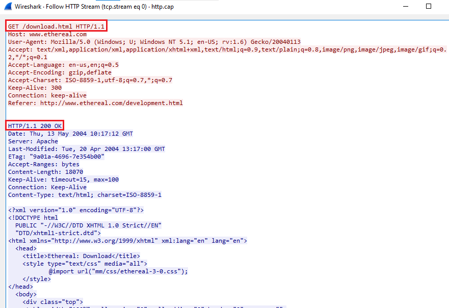
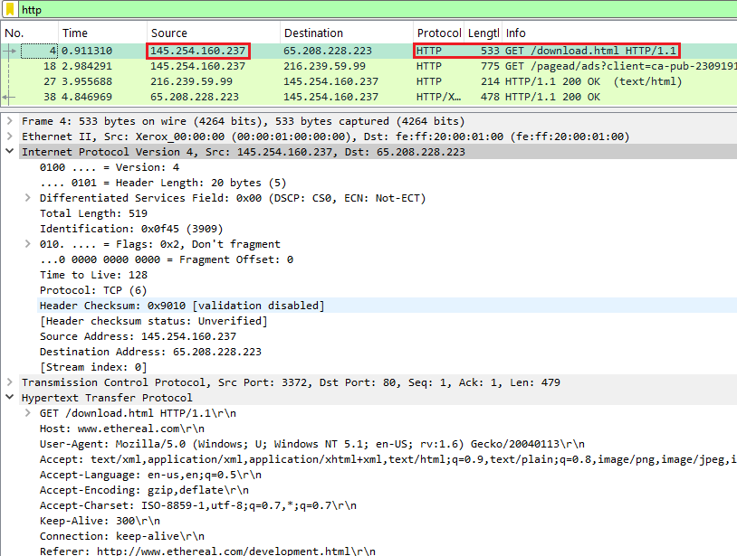
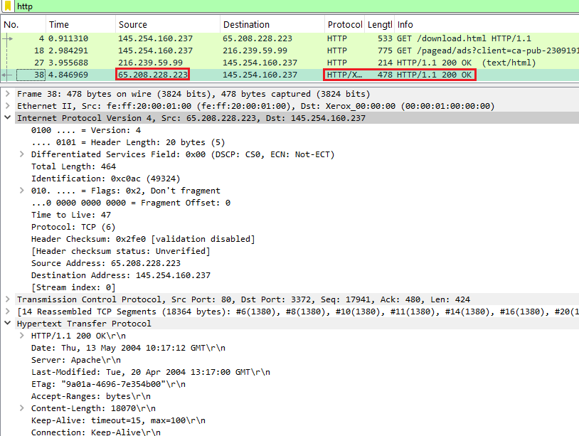
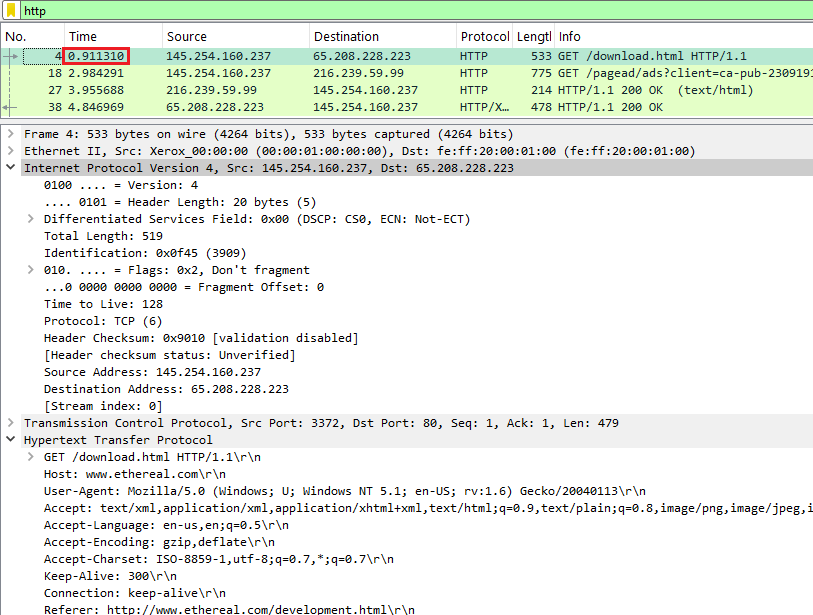
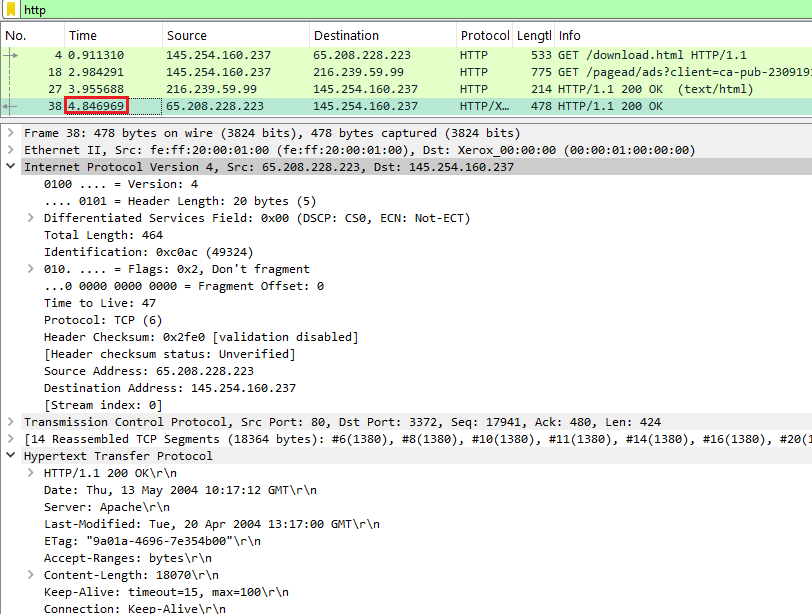
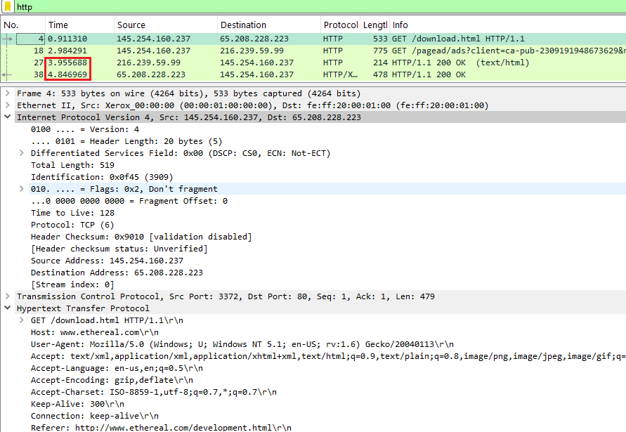
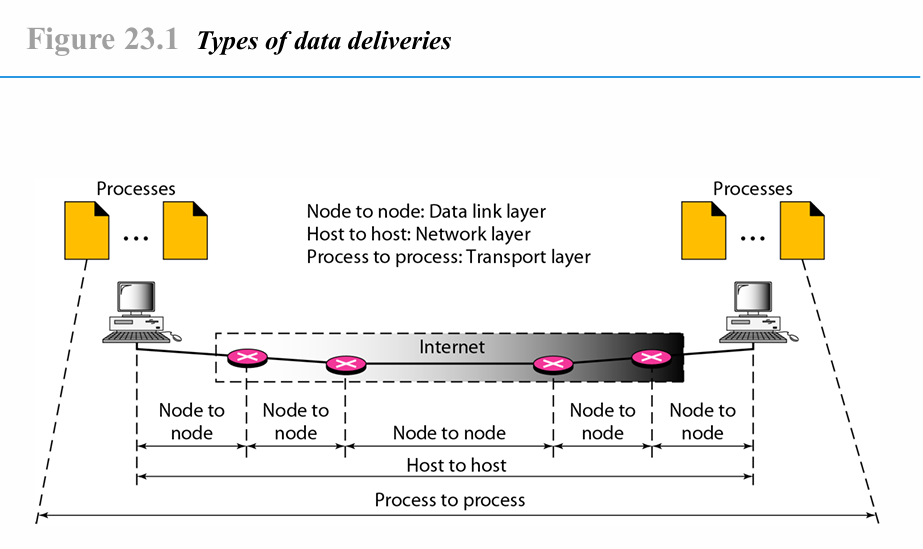

    <h1 style="text-align: center;font-weight: bold">Tugas Review Deskripsi Workshop Administrasi Jaringan</h1>
    <h4 style="text-align: center;">Dosen Pengampu : Dr. Ferry Astika Saputra, S.T., M.Sc.</h4>

 

    
    <h3 style="text-align: center;">Disusun Oleh : </h3>
    

        <strong>Roihanah Inayati Bashiroh</strong> 
        <strong>3123500005 / 2 D3 IT A</strong> 
    

<h3>Politeknik Elektronika Negeri Surabaya Departemen Teknik
Informatika Dan Komputer Program Studi Teknik Informatika 2024/2025</h3>
    

    

## Daftar Isi
- [Analisa file HTTP dengan Wireshark](#analisa-file-http-dengan-wireshark)
- [Deskripsi gambar pada slide](#deskripsi-gambar-pada-slide)
- [Rangkuman tahapan komunikasi menggunakan TCP](#rangkuman-tahapan-komunikasi-menggunakan-tcp)
- [Referensi](#referensi)

## Analisa file http dengan wireshark

### Soal 1

**Pertanyaan:**
Berapa versi HTTP yang digunakan?

**Jawaban:**  
 
Dari hasil Follow TCP Stream, terlihat bahwa request dan response yang digunakan mengikuti protokol HTTP versi 1.1. Ini menunjukkan bahwa komunikasi antara client dan server berlangsung menggunakan HTTP/1.1.
 
 
 
### Soal 2

**Pertanyaan:**
Berapa IP address dari client maupun server?

**Jawaban:**  
 
  
Alamat IP yang digunakan oleh HTTP Client adalah **145.254.160.237**, sedangkan HTTP Server memiliki alamat IP **65.208.228.223**. Koneksi antara keduanya memungkinkan pertukaran data melalui protokol HTTP untuk keperluan pengiriman dan penerimaan informasi.
 
 
 
### Soal 3

**Pertanyaan:**
Berapa waktu dari client mengirimkan HTTP request?

**Jawaban:**  
  
Permintaan HTTP dari client dikirimkan pada waktu 0,911310 detik. Proses ini menandai awal komunikasi antara client dan server dalam pertukaran data.
 
 
 
### Soal 4

**Pertanyaan:**
Berapa Waktu dari server mengirimkan server? dan berapa durasinya?

**Jawaban:**  
 
  
Proses pengiriman data dari client ke server dapat diketahui dengan menghitung selisih antara waktu pengiriman HTTP request oleh client dan waktu pengiriman respons oleh server. Berdasarkan data yang diperoleh, server mengirimkan respons pada detik ke 3,955688, sedangkan client mengirimkan request pada detik ke 4,846969. 

Selisih waktu tersebut dapat dihitung sebagai berikut:  
4,846969 - 3,955688 = 0,891281  

Dengan demikian, diperlukan waktu sekitar 0,891281 detik untuk menyelesaikan satu siklus pengiriman dan penerimaan data dalam bentuk HTTP Response. Durasi ini mencerminkan efisiensi komunikasi antara client dan server, yang dapat bervariasi tergantung pada kondisi jaringan dan performa server.
 
 
 
## Deskripsi gambar pada slide 
 

Gambar di atas adalah *Types of Data Deliveries* dan menjelaskan bagaimana data dikirim dari satu perangkat ke perangkat lain melalui jaringan. Ada tiga jenis pengiriman data yang ditunjukkan berdasarkan lapisan dalam model OSI:

1. **Node to Node (Data Link Layer)**  
   - Ini adalah komunikasi antara perangkat yang terhubung secara fisik, seperti antara komputer dan router, atau antar-router.  
   - Setiap segmen komunikasi di jaringan ditangani oleh lapisan data link, yang memastikan frame data dikirim dengan benar dari satu node ke node berikutnya.  
   - Dalam gambar, jalur *Node to Node* digambarkan dengan koneksi pendek antara setiap perangkat jaringan (router).

2. **Host to Host (Network Layer)**  
   - Ini mencakup komunikasi antara dua perangkat ujung (end-to-end), seperti dari komputer pengirim ke komputer penerima melalui jaringan internet.  
   - Lapisan network bertanggung jawab untuk mengirimkan paket data melalui beberapa node di sepanjang jalur komunikasi.  
   - Pada gambar, *Host to Host* mencakup keseluruhan koneksi dari komputer pengirim ke komputer penerima.

3. **Process to Process (Transport Layer)**  
   - Jenis pengiriman ini terjadi di lapisan transport, di mana data dikirim langsung dari proses aplikasi di satu host ke proses aplikasi di host lain.  
   - Contohnya adalah pengiriman file dari aplikasi di satu komputer ke aplikasi di komputer lain melalui protokol seperti TCP atau UDP.  
   - Jalur *Process to Process* dalam gambar ditunjukkan sebagai koneksi logis yang melintasi seluruh jalur komunikasi.
 
 
 

## Rangkuman tahapan komunikasi menggunakan TCP
Transmission Control Protocol (TCP) adalah protokol komunikasi yang memastikan pengiriman data yang andal antara perangkat dalam jaringan. Proses komunikasi menggunakan TCP terdiri dari tiga tahapan utama:

### 1. Pembentukan Koneksi (Connection Establishment)
Tahap ini dikenal sebagai three-way handshake, yang melibatkan langkah-langkah berikut:
- **SYN:** Klien menginisiasi koneksi dengan mengirimkan segmen SYN (synchronize) ke server, menetapkan nomor urut awal.
- **SYN-ACK:** Server menerima SYN dan merespons dengan segmen SYN-ACK (synchronize-acknowledge), mengonfirmasi penerimaan dan menyediakan nomor urutnya sendiri.
- **ACK:** Klien mengirimkan segmen ACK (acknowledge) terakhir, mengonfirmasi penerimaan SYN-ACK dari server.

### 2. Transfer Data (Data Transfer)
Setelah koneksi terbentuk, data dapat ditransfer antara klien dan server. TCP memastikan bahwa:
- Data dikirim dalam urutan yang benar.
- Segmen yang hilang atau rusak akan dikirim ulang.
- Kontrol aliran diterapkan untuk mencegah pengirim mengirim data lebih cepat daripada yang dapat diterima oleh penerima.

### 3. Terminasi Koneksi (Connection Termination)
Setelah transfer data selesai, koneksi ditutup untuk membebaskan sumber daya. Proses ini biasanya melibatkan:
- Salah satu pihak mengirimkan segmen FIN (finish) untuk mengindikasikan bahwa tidak ada lagi data yang akan dikirim.
- Pihak lain merespons dengan ACK untuk mengonfirmasi penerimaan FIN.
 
 

## Referensi

- [Geeks for Geeks - Transmission Control Protocol](https://www.geeksforgeeks.org/benefits-of-multithreading-in-operating-system/)
- [Wikipedia - Transmission Control Protocol](https://en.wikipedia.org/wiki/Transmission_Control_Protocol)

