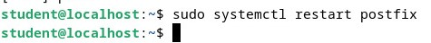
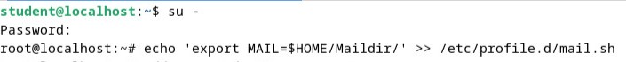
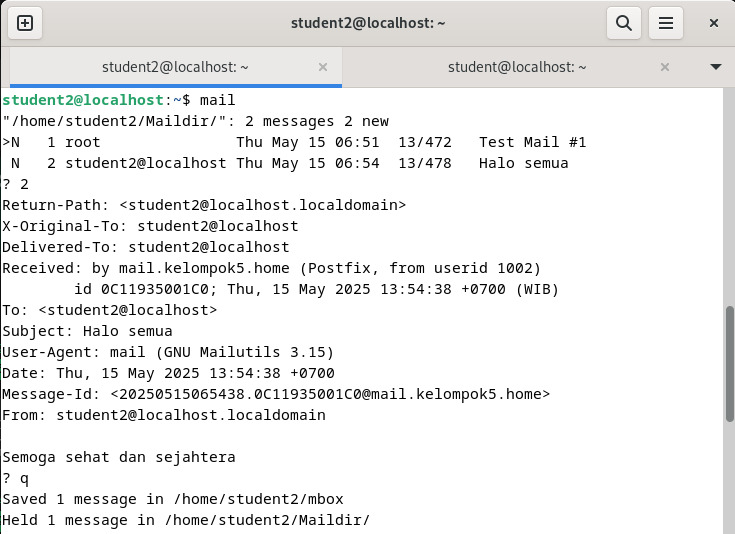

<div align="center">
    <h1 style="text-align: center;font-weight: bold">Instalasi dan Konfigurasi Mail Server<br>Workshop Administrasi Jaringan</h1>
    <h4 style="text-align: center;">Dosen Pengampu : Dr. Ferry Astika Saputra, S.T., M.Sc.</h4>
</div>
<br />
<div align="center">
    
    <h4 style="text-align: center;">Disusun Oleh : </h4>
    <p style="text-align: center;">
        <strong>Roihanah Inayati Bashiroh</strong><br>
        <strong>3123500005 / 2 D3 IT A</strong><br>
    </p>

<h3>Politeknik Elektronika Negeri Surabaya<br>Departemen Teknik
Informatika Dan Komputer<br>Program Studi Teknik Informatika<br>2025/2026</h3>
    <hr>
    <hr>
</div>

---

# Pengenalan Sistem Email

Email atau surat elektronik adalah layanan komunikasi digital yang memungkinkan pengiriman dan penerimaan pesan secara cepat melalui jaringan internet. Email menjadi bagian penting dalam kehidupan sehari-hari, baik untuk keperluan pribadi, pendidikan, maupun profesional.

## Cara Kerja Email Secara Umum

Sistem email bekerja dengan menggunakan beberapa komponen utama:
1. **User Agent (UA)**: Program yang digunakan oleh pengguna untuk menulis dan membaca email, contohnya Gmail atau Outlook.
2. **Mail Server**: Tempat penyimpanan email, baik saat menunggu dikirim maupun setelah diterima.
3. **Protokol Komunikasi**:
   - **SMTP (Simple Mail Transfer Protocol)**: Mengirim email dari pengirim ke server dan antar server.
   - **POP3 (Post Office Protocol 3)**: Mengambil email dari server ke perangkat, biasanya dengan menghapus email dari server.
   - **IMAP (Internet Message Access Protocol)**: Mengakses email secara langsung dari server tanpa menghapusnya, cocok untuk sinkronisasi antar perangkat.

## Alur Pengiriman Email
- Pengguna menulis pesan di aplikasi email (UA).
- Pesan dikirim ke server menggunakan SMTP.
- Server penerima menyimpan pesan di mailbox.
- Penerima mengambil email menggunakan POP3 atau IMAP.

## Kesimpulan
Sebagai sarana komunikasi digital yang terus digunakan secara luas, email memiliki struktur kerja dan sistem yang cukup kompleks namun efisien. Dengan mengenal cara kerjanya—mulai dari penulisan hingga pengambilan pesan—pengguna dapat memanfaatkan email secara maksimal dalam aktivitas sehari-hari. Pemahaman teknis dasar ini juga menjadi bekal penting dalam dunia kerja dan teknologi informasi.

---

## Daftar Isi

1. [Setup Postfix sebagai SMTP Server](#1-setup-postfix-sebagai-smtp-server)
2. [Konfigurasi Dovecot (IMAP, POP3, dan SMTP Auth)](#2-konfigurasi-dovecot-imap-pop3-dan-smtp-auth)
3. [Uji Coba Menggunakan Mailutils](#3-uji-coba-menggunakan-mailutils)

---

## 1. Setup Postfix sebagai SMTP Server

### a) Instalasi Postfix dan SASL

```bash
apt -y install postfix sasl2-bin
```


---

### b) Salin Konfigurasi Awal

```bash
cp /usr/share/postfix/main.cf.dist /etc/postfix/main.cf
```

---

### c) Ubah File Konfigurasi `main.cf`

```bash
nano /etc/postfix/main.cf
```


---

### d) Restart Postfix

```bash
systemctl restart postfix
```



---

## 2. Konfigurasi Dovecot (IMAP, POP3, dan SMTP Auth)

### a) Instalasi Dovecot

```bash
apt -y install dovecot-core dovecot-pop3d dovecot-imapd
```

Perintah di atas digunakan untuk menginstal komponen inti dari Dovecot beserta dukungan protokol POP3 dan IMAP. IMAP berguna untuk mengakses email secara langsung dari server, sedangkan POP3 digunakan untuk mengunduh email ke lokal. Dovecot akan menjadi mail delivery agent (MDA) dalam sistem ini.

---

### b) Ubah File `dovecot.conf`

```bash
nano /etc/dovecot/dovecot.conf
```

Edit file konfigurasi utama Dovecot ini untuk mengaktifkan layanan dasar dan protokol yang digunakan. Biasanya Anda hanya perlu memastikan direktif `!include conf.d/*.conf` sudah tidak dikomentari agar konfigurasi tambahan di folder `conf.d/` terbaca.

---

### c) Set Otorisasi di `10-auth.conf`

```bash
nano /etc/dovecot/conf.d/10-auth.conf
```

Dalam file ini, ubah pengaturan sebagai berikut:

```conf
disable_plaintext_auth = no
auth_mechanisms = plain login
```

- `disable_plaintext_auth = no` memungkinkan login tanpa enkripsi untuk keperluan testing lokal (tidak disarankan untuk server publik).

- `auth_mechanisms = plain login` memastikan metode otentikasi yang digunakan sesuai dengan standar SASL.

---

### d) Tentukan Lokasi Mailbox (`10-mail.conf`)

```bash
nano /etc/dovecot/conf.d/10-mail.conf
```

Konfigurasi ini digunakan untuk menentukan lokasi penyimpanan email. 
Contohnya:

```conf
mail_location = maildir:~/Maildir
```

Pengaturan maildir berarti email akan disimpan di dalam direktori dengan struktur khusus Maildir di home direktori masing-masing user. Format ini lebih efisien dan didukung oleh banyak aplikasi email.


---

### e) Buat Listener untuk SMTP Auth (`10-master.conf`)

```bash
nano /etc/dovecot/conf.d/10-master.conf
```

Temukan blok konfigurasi `service auth` dan ubah menjadi seperti berikut:

```conf
service auth {
  unix_listener /var/spool/postfix/private/auth {
    mode = 0660
    user = postfix
    group = postfix
  }
}
```

Blok ini memungkinkan Dovecot menyediakan layanan autentikasi ke Postfix melalui socket lokal. Postfix akan menggunakan informasi ini untuk mengizinkan atau menolak pengiriman email berdasarkan kredensial user.

---

### f) Restart Dovecot

```bash
systemctl restart dovecot
```

Setelah seluruh konfigurasi selesai, layanan Dovecot perlu dimuat ulang agar perubahan dapat diterapkan.


---

## 3. Uji Coba Menggunakan Mailutils

Setelah konfigurasi Postfix dan Dovecot selesai, langkah selanjutnya adalah menguji sistem pengiriman dan penerimaan email menggunakan tool **Mailutils** sebagai klien email berbasis terminal.

---

### a) Instal Mailutils

Pertama, pastikan aplikasi mail client telah terpasang:

```bash
apt -y install mailutils
```


---

### b) Menetapkan Environment Variable untuk Maildir

Agar mail client dapat mengenali direktori penyimpanan email dengan format `Maildir`, tambahkan environment variable berikut:

```bash
echo 'export MAIL=$HOME/Maildir/' >> /etc/profile.d/mail.sh
```



---

### c) Menambahkan Pengguna Baru untuk Pengujian

Buat akun user tambahan di sistem untuk kebutuhan pengujian pengiriman email antar pengguna:

```bash
adduser student2
```


---

### d) Masuk ke Akun `student2` dan Pengujian Kirim Email Antar Pengguna

Lakukan login sebagai user penerima:

```bash
su - student2
```

Setelah user baru dibuat, coba kirimkan email dari pengguna `student` ke `student2`.


---


### f) Periksa Kotak Masuk

Setelah berhasil login sebagai `student2`, gunakan perintah `mail` untuk melihat apakah pesan sudah diterima:

```bash
mail
```




Jika terdapat email baru, daftar pesan akan ditampilkan. Pilih angka sesuai nomor email untuk membacanya. Tekan `q` untuk keluar dari tampilan mail client.
