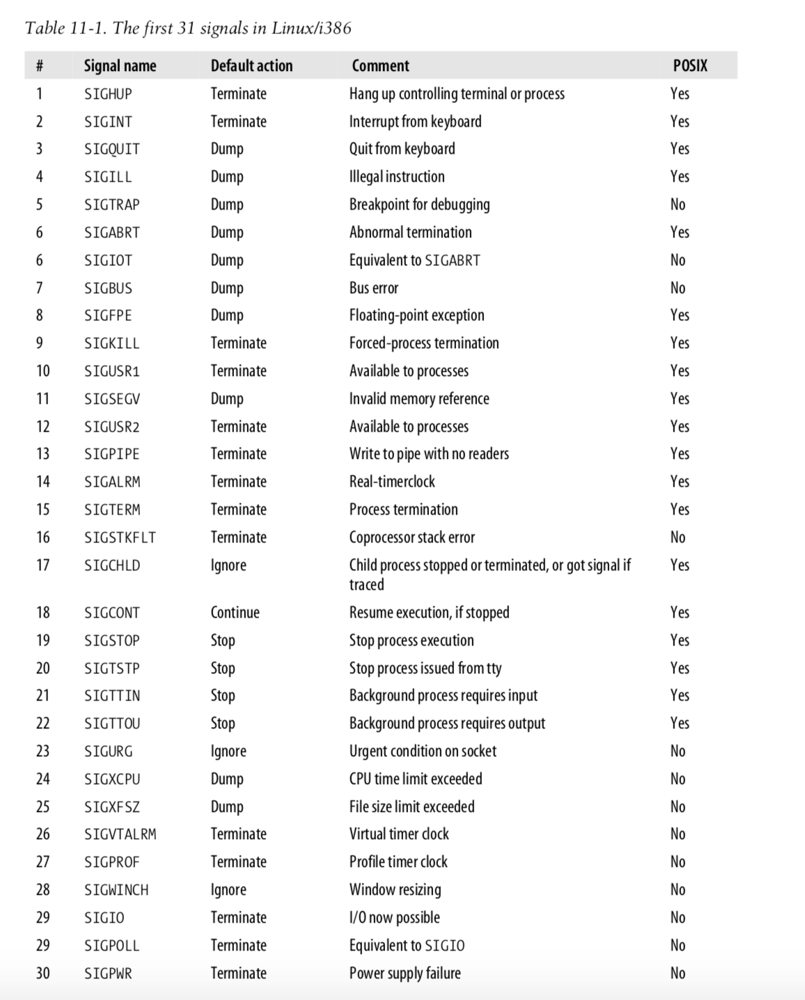
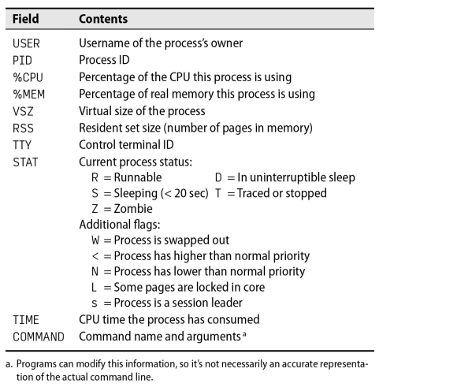

<div align="center">
    <h1 style="text-align: center;font-weight: bold">Tugas Unix-and-Linux-sysadmin-notes<br><br>
    Workshop Administrasi Jaringan</h1>
    <h4 style="text-align: center;">Dosen Pengampu : Dr. Ferry Astika Saputra, S.T., M.Sc.</h4>
</div>
<br />
<div align="center">
    
    <h3 style="text-align: center;">Disusun Oleh : </h3>
    <p style="text-align: center;">
        <strong>Roihanah Inayati Bashiroh</strong><br>
        <strong>3123500005 / 2 D3 IT A</strong><br>
    </p>

<h3>Politeknik Elektronika Negeri Surabaya<br>Departemen Teknik
Informatika Dan Komputer<br>Program Studi Teknik Informatika<br>2024/2025</h3>
    <hr>
    <hr>
</div>

# Chapter 4: Process Control


## Daftar Isi

- [Components of a Process](#components-of-a-process)
- [The PID: process ID number](#the-pid-process-id-number)
- [The PPID: parent process ID number](#the-ppid-parent-process-id-number)
- [The UID and EUID: user ID and effective user ID](#the-uid-and-euid-user-id-and-effective-user-id)
- [Lifecycle of a Process](#lifecycle-of-a-process)
- [Signals](#signals)
- [Kill: send signals](#kill-send-signals)
- [PS: Monitoring Processes](#ps-monitoring-processes)
- [Interactive monitoring with top](#interactive-monitoring-with-top)
- [Nice and renice: changing process priority](#nice-and-renice-changing-process-priority)
- [The /proc filesystem](#the-proc-filesystem)
- [Strace and truss](#strace-and-truss)
- [Runaway processes](#runaway-processes)
- [cron: schedule command](#cron-schedule-command)
- [Format of crontab](#format-of-crontab)
- [Systemd timer](#systemd-timer)
- [Common use for scheduled tasks](#common-use-for-scheduled-tasks)
<br>
<br>

### Components of a Process
&nbsp;&nbsp; Proses terdiri dari ruang alamat (address space) dan struktur data dalam kernel. Ruang alamat adalah sekumpulan halaman memori yang digunakan untuk menyimpan kode, data, dan stack proses. Halaman ini biasanya berukuran 4KiB atau 8KiB.

&nbsp;&nbsp; Kernel menggunakan struktur data untuk melacak status proses, prioritas, parameter penjadwalan, dan sumber daya yang digunakan seperti CPU, memori, file terbuka, dan port jaringan.

Informasi penting yang dicatat kernel tentang proses meliputi:

- Peta ruang alamat proses
- Status proses (berjalan, tidur, dll.)
- Prioritas proses
- Sumber daya yang digunakan
- File dan port jaringan yang dibuka
- Sinyal yang diblokir
- Pemilik proses (User ID)

&nbsp;&nbsp; **Thread** adalah konteks eksekusi dalam proses yang berbagi ruang alamat dan sumber daya. Proses dapat memiliki banyak thread untuk melakukan eksekusi secara paralel. Thread lebih ringan dan lebih murah dibuat dibandingkan proses.

&nbsp;&nbsp; Contohnya, pada server web, proses utama mendengarkan koneksi masuk dan membuat thread baru untuk menangani setiap permintaan. Dengan banyak thread, server bisa menangani banyak permintaan secara bersamaan.
<br>
<br>
<br>

### The PID: process ID number
&nbsp;&nbsp; Setiap proses memiliki nomor unik yang disebut **PID (Process ID)**, yang diberikan oleh kernel saat proses dibuat. PID digunakan untuk mengidentifikasi proses dalam berbagai sistem seperti mengirim sinyal.  

&nbsp;&nbsp; Dengan konsep **namespace**, beberapa proses bisa memiliki PID yang sama dalam lingkungan terisolasi seperti **container**, yang memungkinkan menjalankan beberapa instance aplikasi secara terpisah pada satu sistem.
<br>
<br>
<br>

### The PPID: parent process ID number
&nbsp;&nbsp; PPID (Parent Process ID) adalah nomor ID proses induk yang membuat proses tersebut. PPID digunakan untuk merujuk ke proses induk dalam berbagai panggilan sistem, seperti mengirim sinyal ke proses induk.
<br>
<br>
<br>

### The UID and EUID: user ID and effective user ID
&nbsp;&nbsp; **UID** (User ID) adalah ID pengguna yang memulai proses. **EUID** (Effective User ID) adalah ID pengguna yang digunakan proses untuk menentukan akses terhadap sumber daya seperti file, port jaringan, dan lainnya. EUID berperan dalam mengontrol izin akses pada sistem.
<br>
<br>
<br>

### Lifecycle of a Process
&nbsp;&nbsp; Dalam sistem operasi, proses baru dibuat dengan menggunakan sistem pemanggilan **fork**. **fork** membuat salinan proses induk yang hampir identik, tetapi memiliki **PID** (Process ID) yang berbeda dan informasi akuntansi sendiri. Pada Linux, pemanggilan ini secara internal menggunakan **clone**, yang mendukung fitur tambahan seperti thread, namun **fork** tetap dipertahankan untuk kompatibilitas lama.  

&nbsp;&nbsp; Saat sistem menyala (booting), kernel secara otomatis membuat beberapa proses, termasuk **init** atau **systemd** yang memiliki nomor proses 1. Proses ini menjalankan skrip startup sistem. Semua proses lainnya adalah turunan dari proses ini, kecuali proses yang langsung dibuat oleh kernel.
<br>
<br>
<br>

### Signals
&nbsp;&nbsp; Sinyal adalah cara untuk mengirim notifikasi ke suatu proses, digunakan untuk memberi tahu bahwa suatu peristiwa telah terjadi. Terdapat sekitar 30 jenis sinyal yang digunakan untuk berbagai tujuan, seperti:  

- Komunikasi antar proses.  
- Mematikan, menghentikan, atau menunda proses saat tombol tertentu ditekan di terminal.  
- Digunakan administrator untuk tujuan tertentu dengan perintah **kill**.  
- Dikirim oleh kernel saat proses melakukan pelanggaran, seperti pembagian dengan nol.  
- Memberi tahu proses tentang kondisi penting, seperti kematian proses anak atau ketersediaan data pada saluran I/O.
<br>

<br>
- **KILL**: Sinyal yang tidak bisa diblokir, langsung menghentikan proses di level kernel tanpa bisa ditangani oleh proses.
- **INT**: Dikirim saat pengguna menekan `Ctrl + C` di terminal, meminta proses berhenti. Program sederhana akan langsung berhenti, sedangkan program interaktif akan membersihkan proses sebelum menunggu input pengguna lagi.
- **TERM**: Permintaan penghentian proses secara penuh, diharapkan proses akan membersihkan status sebelum keluar.
- **HUP**: Dikirim saat terminal ditutup, awalnya untuk menunjukkan sambungan telepon terputus. Sekarang sering digunakan untuk me-restart daemon agar memuat konfigurasi baru.
- **QUIT**: Mirip dengan TERM, tetapi menghasilkan *core dump* jika tidak ditangani. Beberapa program menggunakan sinyal ini untuk fungsi lain.
<br>
<br>
<br>

### Kill: send signals
&nbsp;&nbsp; Perintah **kill** digunakan untuk mengirim sinyal ke proses, biasanya untuk menghentikan proses. Secara default, **kill** mengirim sinyal **TERM** (terminate). Pengguna biasa hanya bisa menghentikan proses miliknya sendiri, sedangkan **root** bisa menghentikan proses apapun.

**Sintaks:**
```bash
kill [-signal] pid
```
- **signal**: Nomor atau nama sinyal yang dikirim.
- **pid**: ID proses yang ingin dihentikan.

&nbsp;&nbsp; Jika sinyal tidak ditentukan, **kill** akan menggunakan sinyal TERM, namun sinyal ini bisa diabaikan oleh proses. Untuk memastikan proses benar-benar mati, gunakan **kill -9 pid** karena sinyal **KILL** tidak bisa diabaikan.

**Perintah Lain:**
- **killall**: Menghentikan proses berdasarkan nama, bukan PID. Contoh:
  
  ```bash
  killall firefox
  ```

- **pkill**: Mirip dengan **killall** tapi memiliki lebih banyak opsi. Contoh:
  
  ```bash
  pkill -u abdoufermat
  ```
  (Menghentikan semua proses milik pengguna **abdoufermat**).
<br>
<br>
<br>

### PS: Monitoring Processes
&nbsp;&nbsp; Perintah **ps** digunakan oleh administrator sistem untuk memantau proses yang berjalan di sistem operasi. Perintah ini menampilkan informasi seperti PID (Process ID), UID (User ID), prioritas, terminal kontrol, penggunaan memori, waktu penggunaan CPU, dan status proses (berjalan, berhenti, tidur, dll).  

Dengan menjalankan perintah **ps aux**, pengguna bisa melihat:  
- **a**: Menampilkan semua proses dari semua pengguna  
- **u**: Memberikan informasi detail tentang proses  
- **x**: Menampilkan proses yang tidak terkait dengan terminal
<br>  

<br>
&nbsp;&nbsp; Perintah `ps lax` digunakan untuk menampilkan informasi teknis tentang proses yang sedang berjalan. Perintah ini lebih cepat dibandingkan `ps aux` karena tidak perlu menerjemahkan nama user dan grup.  

Keterangan kolom pada output:  
- **F**: Flag proses  
- **UID**: ID user  
- **PID**: ID proses  
- **PPID**: ID proses induk  
- **PRI**: Prioritas proses  
- **NI**: Nice value  
- **VSZ**: Memori virtual yang digunakan  
- **RSS**: Memori fisik yang digunakan  
- **STAT**: Status proses  
- **TTY**: Terminal yang digunakan  
- **TIME**: Waktu CPU yang digunakan  
- **COMMAND**: Perintah yang dijalankan  

Untuk mencari proses tertentu, gunakan perintah:  
```bash
ps aux | grep firefox
```  
Agar hasil pencarian tidak menampilkan baris `grep` itu sendiri, tambahkan opsi `-v`:  
```bash
ps aux | grep -v grep | grep firefox
```  

PID (Process ID) dapat ditemukan dengan perintah:  
- `pgrep firefox`  
- `pidof /usr/bin/firefox`
<br>
<br>
<br>

### Interactive monitoring with top
&nbsp;&nbsp; Perintah **top** menampilkan informasi sistem secara real-time, termasuk ringkasan sistem dan daftar proses yang sedang berjalan di Linux. Tampilan ini bisa dikonfigurasi sesuai kebutuhan pengguna dan disimpan untuk digunakan kembali. Secara default, pembaruan data terjadi setiap 1-2 detik.

&nbsp;&nbsp; Selain itu, ada perintah **htop** yang memiliki fungsi serupa namun dengan antarmuka yang lebih interaktif. **htop** memungkinkan pengguna menggulir secara vertikal dan horizontal untuk melihat semua proses beserta perintah lengkapnya, serta menawarkan lebih banyak opsi operasi.
<br>
<br>
<br>

### Nice and renice: changing process priority
Nice dan Renice digunakan untuk mengatur prioritas proses pada sistem operasi.  

- **Nice** digunakan untuk memulai proses dengan tingkat prioritas tertentu. Nilai nice berkisar dari **-20 hingga +19** di Linux (semakin rendah nilainya, semakin tinggi prioritasnya).  
  **Sintaks:** `nice -n [nilai_nice] [perintah]`  
  Contoh: `nice -n 10 sh infinite.sh &`  

- **Renice** digunakan untuk mengubah prioritas proses yang sudah berjalan berdasarkan **PID (Process ID)**.  
  **Sintaks:** `renice -n [nilai_nice] -p [pid]`  
  Contoh: `renice -n 10 -p 1234`  

Prioritas proses dihitung dengan rumus:  
`priority_value = 20 + nice_value`  
Semakin kecil nilai nice, semakin tinggi prioritas proses tersebut.  

Secara default, nice value = **0**. Proses dengan prioritas tinggi mendapat waktu CPU lebih banyak dibandingkan proses prioritas rendah.
<br>
<br>
<br>

### The /proc filesystem
&nbsp;&nbsp; Direktori **/proc** pada Linux adalah *pseudo-filesystem* yang digunakan oleh kernel untuk menampilkan informasi tentang status sistem. Selain informasi proses, direktori ini juga berisi data statistik sistem.  

&nbsp;&nbsp; Setiap proses direpresentasikan sebagai direktori dengan nama sesuai **PID** (Process ID). Di dalamnya terdapat berbagai file yang berisi informasi seperti **command line**, **variabel lingkungan (environment variables)**, dan **file descriptor**.
<br>


<br>
<br>
<br>

### Strace and truss
&nbsp;&nbsp; Strace (Linux) dan Truss (FreeBSD) adalah perintah untuk melacak **system call** dan **sinyal** yang digunakan oleh suatu proses. Tools ini berguna untuk **debugging** atau memahami apa yang sedang dilakukan oleh suatu program.

Contoh penggunaan:  
```bash
strace -p 5810
```
Perintah di atas melacak proses dengan PID 5810 (program **top**). Output menunjukkan langkah-langkah program seperti:  
1. Mengecek waktu saat ini (**gettimeofday**).  
2. Membuka direktori **/proc**.  
3. Membaca file **/proc/1/stat** untuk mendapatkan informasi tentang proses **init**.
<br>
<br>
<br>

### Runaway processes
&nbsp;&nbsp; Runaway process adalah proses yang tidak merespons sistem dan menggunakan 100% CPU, sehingga membuat sistem berjalan sangat lambat. Proses ini dapat dihentikan menggunakan perintah **kill**. Jika proses tidak merespons sinyal **TERM**, bisa menggunakan sinyal **KILL** dengan perintah:  

```bash
kill -9 pid  
```  
atau  
```bash
kill -KILL pid  
```  

&nbsp;&nbsp; Untuk menyelidiki penyebab runaway process, bisa menggunakan **strace** atau **truss**. Jika proses menghasilkan output besar hingga memenuhi filesystem, cek penggunaan filesystem dengan perintah:  
```bash
df -h  
```  
&nbsp;&nbsp; Gunakan perintah **du** untuk menemukan file atau direktori terbesar, dan **lsof** untuk melihat file apa saja yang sedang dibuka oleh proses tersebut:  
```bash
lsof -p pid  
```
<br>
<br>
<br>

### Periodic processes
### cron: schedule command 
&nbsp;&nbsp; Cron adalah layanan (daemon) di sistem operasi Linux yang digunakan untuk menjalankan perintah secara otomatis pada jadwal tertentu. Layanan ini aktif sejak sistem dinyalakan hingga dimatikan.  

&nbsp;&nbsp; Cron membaca file konfigurasi bernama **crontab** (cron table) yang berisi daftar perintah dan waktu eksekusinya. Perintah akan dijalankan oleh shell (sh), sehingga hampir semua perintah yang bisa dilakukan secara manual di terminal dapat dijadwalkan dengan cron.  

File crontab untuk setiap pengguna disimpan di:  
- **/var/spool/cron** (Linux)  
- **/var/cron/tabs** (FreeBSD)
<br>

### Format of crontab
Crontab memiliki 5 kolom waktu dengan urutan:  
`menit (0-59) | jam (0-23) | tanggal (1-31) | bulan (1-12) | hari (0-6)`  
**Contoh:**
- `30 2 * * *` → Menjalankan perintah setiap hari pukul 02:30  
- `30 22 1 * *` → Menjalankan perintah setiap tanggal 1 pukul 22:30  
- `*/30 * * * *` → Menjalankan perintah setiap 30 menit  

**Manajemen Crontab**
- `crontab -e` → Mengedit crontab  
- `crontab -l` → Melihat crontab yang aktif  
- `crontab -r` → Menghapus crontab  

Crontab membantu otomatisasi tugas tanpa perlu intervensi manual.
<br>
<br>
<br>

### Systemd timer
&nbsp;&nbsp; Systemd timer adalah file konfigurasi unit dengan ekstensi **.timer** yang berfungsi sebagai alternatif dari **cron jobs**. Timer ini lebih fleksibel dan lebih kuat dibandingkan cron jobs.

&nbsp;&nbsp; Systemd timer bekerja dengan memicu unit layanan (**service unit**) pada waktu yang ditentukan. Timer ini bisa diaktifkan saat sistem booting atau berdasarkan event tertentu.

Untuk mengelola systemd timer, digunakan perintah:

```bash
systemctl list-timers
```
Perintah tersebut menampilkan daftar timer yang aktif beserta jadwal eksekusinya.

Contoh konfigurasi timer:

```ini
[Timer]
OnCalendar=daily        # Menjadwalkan timer setiap hari
AccuracySec=1h         # Toleransi keterlambatan maksimal 1 jam
Persistent=true        # Timer tetap berjalan meskipun sistem restart
```
<br>
<br>
<br>

### Common use for scheduled tasks
**Penggunaan Umum untuk Tugas Terjadwal (Scheduled Tasks):**  

1. **Mengirim Email Otomatis**  
   Digunakan untuk mengirim laporan harian atau hasil eksekusi perintah secara otomatis menggunakan *cron* atau *systemd timers*.  

2. **Membersihkan File Sistem**  
   Menjalankan skrip untuk membersihkan direktori seperti *trash* setiap hari pada waktu tertentu, misalnya menghapus file lebih dari 30 hari.  

3. **Rotasi Log File**  
   Membagi log file menjadi beberapa bagian berdasarkan ukuran atau tanggal, menjaga beberapa versi lama tetap tersedia secara otomatis.  

4. **Menjalankan Batch Jobs**  
   Memproses data dalam jumlah besar seperti antrean pesan atau data ETL (Extract, Transform, Load) secara berkala.  

5. **Backup dan Mirroring**  
   Melakukan pencadangan otomatis atau menyalin direktori ke sistem lain secara berkala menggunakan *rsync*.
