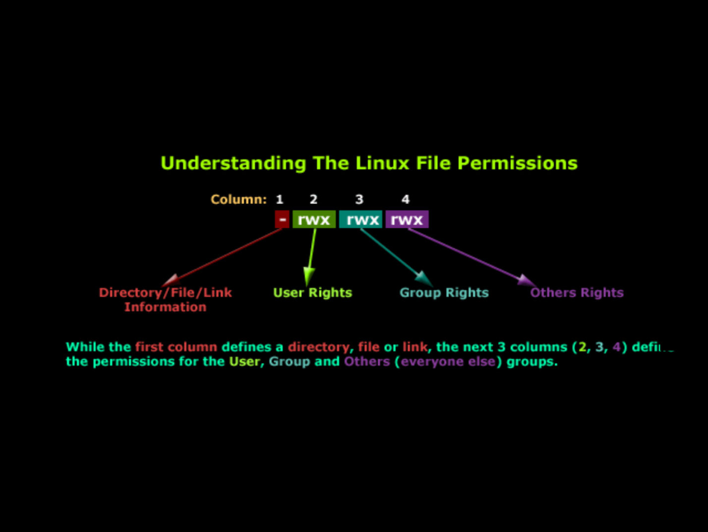

<div align="center">
    <h1 style="text-align: center;font-weight: bold">Tugas Unix-and-Linux-sysadmin-notes<br><br>
    Workshop Administrasi Jaringan</h1>
    <h4 style="text-align: center;">Dosen Pengampu : Dr. Ferry Astika Saputra, S.T., M.Sc.</h4>
</div>
<br />
<div align="center">
    
    <h3 style="text-align: center;">Disusun Oleh : </h3>
    <p style="text-align: center;">
        <strong>Roihanah Inayati Bashiroh</strong><br>
        <strong>3123500005 / 2 D3 IT A</strong><br>
    </p>

<h3>Politeknik Elektronika Negeri Surabaya<br>Departemen Teknik
Informatika Dan Komputer<br>Program Studi Teknik Informatika<br>2024/2025</h3>
    <hr>
    <hr>
</div>

# Chapter 5: The Filesystem


## Daftar Isi

- [Pathnames](#pathnames)
- [Filesystem Mounting and Unmounting](#filesystem-mounting-and-unmounting)
- [Organization of the file tree](#organization-of-the-file-tree)
- [File types](#file-types)
- [File attributes](#file-attributes)
- [Permission bits](#permission-bits)
- [The setuid and setgid bits](#the-setuid-and-setgid-bits)
- [The sticky bit](#the-sticky-bit)
- [ls: list and inspect files](#ls-list-and-inspect-files)
- [chmod: change permissions](#chmod-change-permissions)
- [chown: change ownership](#chown-change-ownership)
- [chgrp: change group](#chgrp-change-group)
- [umask: set default permissions](#umask-set-default-permissions)
- [Access Control Lists](#access-control-lists)
- [Implementation of ACLs](#implementation-of-acls)
- [POSIX ACLs](#posix-acls)
- [NFSv4 ACLs](#nfsv4-acls)
<br>
<br>


&nbsp;&nbsp; Sistem file berfungsi untuk merepresentasikan dan mengatur sumber daya penyimpanan pada sistem.

Komponen utama sistem file terdiri dari:  
- **Namespace**: Penamaan dan pengorganisasian data dalam hierarki.  
- **API**: Kumpulan sistem panggilan untuk navigasi dan manipulasi data.  
- **Model Keamanan**: Skema perlindungan, penyembunyian, dan berbagi data.  
- **Implementasi**: Perangkat lunak yang menghubungkan model logis dengan perangkat keras.

&nbsp;&nbsp; Jenis sistem file populer adalah **ext4**, **XFS**, **UFS**, **ZFS**, dan **Btrfs**. Ada juga sistem file lain seperti **VxFS** (Veritas) dan **JFS** (IBM).  

&nbsp;&nbsp; Sistem file asing seperti **FAT** dan **NTFS** digunakan oleh Windows, serta **ISO 9660** digunakan untuk CD/DVD.  

&nbsp;&nbsp; Sebagian besar sistem file modern berfokus pada peningkatan kecepatan, keandalan, atau menambahkan fitur tambahan di atas fungsi tradisional.
<br>
<br>
<br>

### Pathnames
&nbsp;&nbsp; Kata *folder* berasal dari istilah di Windows dan macOS, tetapi dalam konteks teknis lebih tepat menggunakan istilah *directory*. 

&nbsp;&nbsp; Urutan direktori yang menunjukkan lokasi file disebut *pathname*. Pathname bisa berupa:  
- **Absolute**: Menunjukkan lokasi lengkap file dari root (misal: `/home/username/file.txt`).  
- **Relative**: Menunjukkan lokasi file berdasarkan posisi saat ini (misal: `./file.txt`).
<br>
<br>
<br>

### Filesystem Mounting and Unmounting
&nbsp;&nbsp; Filesystem pada Linux terdiri dari potongan-potongan kecil yang disebut **filesystem**, di mana setiap filesystem memiliki satu direktori beserta subdirektori dan file di dalamnya. Tata letak keseluruhan filesystem disebut **file tree**, sedangkan filesystem yang terpasang dianggap sebagai cabang dari file tree.

&nbsp;&nbsp; Filesystem dihubungkan ke file tree menggunakan perintah **mount** dengan direktori tertentu sebagai **mount point**. Contoh:  
```bash
mount /dev/sda4 /users
```
&nbsp;&nbsp; Untuk melepaskan filesystem, digunakan perintah **umount**. Terdapat dua opsi:  
- **umount -l** (lazy unmount): Melepaskan filesystem dari hierarki nama, tetapi filesystem baru benar-benar dilepas saat tidak lagi digunakan.  
- **umount -f** (force unmount): Melepaskan filesystem secara paksa meskipun sedang digunakan.

&nbsp;&nbsp; Sebelum menggunakan opsi paksa, disarankan untuk mengecek proses yang menggunakan filesystem dengan perintah:  
- **lsof**: Menampilkan daftar proses yang menggunakan filesystem.  
- **fuser**: Menunjukkan proses yang aktif pada filesystem tertentu.  

Contoh:  
```bash
lsof /home/abdou
```
&nbsp;&nbsp; Setelah mengetahui proses yang aktif, proses tersebut bisa diselidiki lebih lanjut menggunakan perintah:  
```bash
ps up "1234 5678 91011"
```
&nbsp;&nbsp; Kemudian, proses tersebut dapat dimatikan agar filesystem bisa dilepas dengan aman.
<br>
<br>
<br>

### Organization of the file tree
&nbsp;&nbsp; Struktur pohon file pada sistem UNIX kurang terorganisir dengan baik karena adanya konvensi penamaan yang tidak konsisten dan penyebaran file yang acak. 

**Ringkasan:**
- **Root Filesystem**: Berisi direktori root dan file penting minimal. Kernel OS biasanya ada di **/boot**, namun lokasi dan namanya bisa bervariasi.
- **/etc**: Berisi file konfigurasi sistem penting.
- **/sbin** & **/bin**: Menyimpan utilitas penting.
- **/tmp**: Tempat file sementara.
- **/dev**: Dulu menjadi bagian root filesystem, sekarang merupakan filesystem virtual.
- **/lib** & **/lib64**: Menyimpan library bersama, kadang dipindahkan ke **/usr/lib**.
- **/usr**: Menyimpan program standar, manual, dan library.
- **/var**: Menyimpan log file, data spool, dan file yang sering berubah.

&nbsp;&nbsp; Baik **/usr** maupun **/var** harus tersedia agar sistem bisa beroperasi dalam mode multiuser.
<br>


<br>
<br>
<br>

### File types
Sebagian besar sistem file mendefinisikan **tujuh jenis file**, yaitu:  

1. **Regular files** (file biasa)  
2. **Directories** (direktori)  
3. **Character devices files** (file perangkat karakter)  
4. **Block devices files** (file perangkat blok)  
5. **Local domain sockets** (socket domain lokal)  
6. **Named pipes (FIFOs)**  
7. **Symbolic links** (tautan simbolik)  

Untuk mengetahui jenis file, gunakan perintah:  
```bash
file nama_file
```  
Contoh:  
```bash
file /bin/bash
```  
Perintah tersebut akan menampilkan informasi detail tentang tipe file.  

Selain itu, bisa juga menggunakan:  
```bash
ls -ld nama_direktori
```  
Flag **-d** digunakan untuk menampilkan informasi direktori, bukan isinya.
<br>


<br>
1. **Regular Files**  
   File biasa terdiri dari serangkaian byte tanpa struktur khusus dari sistem file. Contohnya seperti file teks, file data, program eksekusi, dan library.

2. **Directory**  
   Direktori adalah referensi nama yang menunjuk ke file lain.

3. **Hard Link**  
   Hard link digunakan untuk memberikan satu file beberapa nama berbeda. Perintah **ln** digunakan untuk membuat hard link, dan opsi **ls -i** menampilkan jumlah hard link dari sebuah file.

4. **Device Files**  
   File perangkat digunakan agar program bisa berkomunikasi dengan perangkat keras. Terdapat dua jenis:  
   - **Character Device**: Mengelola data dalam bentuk karakter satu per satu.  
   - **Block Device**: Mengelola data dalam blok besar.  
   Device file dikenali melalui **major number** (driver perangkat) dan **minor number** (unit perangkat).

5. **Local Domain Socket**  
   Digunakan untuk komunikasi antar proses di dalam satu host, mirip dengan network socket tetapi tidak keluar jaringan.

6. **Named Pipes (FIFO)**  
   Mirip dengan local domain socket, digunakan untuk komunikasi antar proses dalam host yang sama.

7. **Symbolic Link (Soft Link)**  
   Link yang menunjuk ke file lain berdasarkan nama. Lebih fleksibel dibandingkan hard link karena bisa menunjuk ke file di filesystem berbeda dan juga ke direktori.

   Contoh:  
   ```bash
   ln -s /bin /usr/bin
   ls -l /usr/bin
   ```
<br>
<br>
<br>

### File attributes
&nbsp;&nbsp; Setiap file di sistem Unix dan Linux memiliki 9 bit izin yang menentukan siapa yang bisa membaca, menulis, dan mengeksekusi file. Ditambah 3 bit lainnya yang mempengaruhi cara kerja program yang dapat dieksekusi, sehingga total ada 12 bit mode. 

&nbsp;&nbsp; Bit-bit ini disimpan bersama 4 bit tipe file yang ditetapkan saat file dibuat dan tidak bisa diubah. Namun, pemilik file dan superuser bisa mengubah 12 bit mode menggunakan perintah **chmod**.
<br>


<br>
<br>
<br>

### Permission bits
Permission bits dibagi menjadi tiga kelompok:  
- **u (user/owner):** Hak akses pemilik file  
- **g (group):** Hak akses grup file  
- **o (others):** Hak akses untuk pengguna lain  

Setiap kelompok terdiri dari 3 bit:  
- **r (read):** Membaca file atau melihat isi direktori  
- **w (write):** Mengubah atau menulis file (dalam direktori, bisa menambah/menghapus file)  
- **x (execute):** Menjalankan file atau memasuki direktori  

Permission juga bisa ditulis dalam notasi oktal (base 8):  
- 400, 200, 100 → Owner  
- 40, 20, 10 → Group  
- 4, 2, 1 → Others  

&nbsp;&nbsp; Untuk file executable, file bisa berupa **binary** (dijalankan langsung oleh CPU) atau **script** (dijalankan oleh interpreter seperti shell atau Python). Script biasanya diawali dengan **shebang** (`#!/usr/bin/perl`) untuk menunjukkan interpreter.  

Pada direktori:  
- **x (execute):** Memungkinkan masuk ke direktori tanpa melihat isinya  
- **r + x:** Melihat isi direktori  
- **w + x:** Menambah, menghapus, atau mengganti nama file dalam direktori  
<br>
<br>
<br>

### The setuid and setgid bits
&nbsp;&nbsp; Bit **setuid** (4000) membuat file yang dieksekusi berjalan dengan hak akses pemilik file, bukan pengguna yang menjalankannya.  
Bit **setgid** (2000) membuat file berjalan dengan hak akses grup pemilik file.  

&nbsp;&nbsp; Jika **setgid** diterapkan pada direktori, semua file baru di dalam direktori tersebut akan mewarisi grup pemilik direktori, bukan grup pengguna yang membuat file. Hal ini memudahkan berbagi file antar pengguna dalam satu grup.
<br>
<br>
<br>

### The sticky bit
&nbsp;&nbsp; **Sticky bit** (nilai oktal 1000) digunakan pada direktori untuk mencegah pengguna menghapus atau mengganti nama file yang bukan milik mereka. Fitur ini berguna pada direktori bersama seperti **/tmp** agar file hanya dapat dihapus oleh pemiliknya.
<br>
<br>
<br>

### ls: list and inspect files
&nbsp;&nbsp; Perintah **ls** digunakan untuk menampilkan daftar file dan direktori, serta memeriksa atributnya.  

&nbsp;&nbsp; Opsi **-l** digunakan untuk menampilkan format panjang yang mencakup:  
- Mode file  
- Jumlah hard link  
- Pemilik file  
- Grup file  
- Ukuran file (dalam byte)  
- Waktu modifikasi terakhir  
- Nama file  

&nbsp;&nbsp; Setiap direktori memiliki minimal 2 hard link, yaitu **.** (direktori itu sendiri) dan **..** (direktori induk).  

&nbsp;&nbsp; Untuk file perangkat (device file), format output sedikit berbeda. Contoh:  
```bash
$ ls -l /dev/tty0
crw--w---- 1 root tty 4, 0 Mar  1  2020 /dev/tty0
```  
&nbsp;&nbsp; Huruf **c** di awal menunjukkan bahwa file tersebut adalah **character device file**. Angka **4, 0** menunjukkan **major** dan **minor device number**.
<br>
<br>
<br>

### chmod: change permissions
&nbsp;&nbsp; Perintah chmod mengubah mode suatu berkas. Anda dapat menggunakan notasi oktal atau notasi simbolik.
<br>


<br>
&nbsp;&nbsp; Sintaks mnemonik `chmod` digunakan untuk mengatur izin akses file di sistem Linux. Berikut beberapa contohnya:

- **u+w**: Tambahkan izin menulis untuk pemilik file.
- **ug=rw,o=r**: Berikan izin membaca dan menulis untuk pemilik dan grup, serta izin membaca untuk pengguna lain.
- **a-x**: Hapus izin eksekusi untuk semua pengguna.
- **ug=srx,o=**: Atur bit setuid, setgid, dan sticky untuk pemilik dan grup (izin membaca dan eksekusi).
- **g=u**: Samakan izin grup dengan izin pemilik.

&nbsp;&nbsp; Tips tambahan: Gunakan opsi `--reference` untuk menyalin izin dari file lain. Contoh: `chmod --reference=sourcefile targetfile`.
<br>
<br>
<br>

### chown: change ownership
&nbsp;&nbsp; Perintah **`chown`** digunakan untuk mengubah pemilik (owner) dan grup dari sebuah file atau direktori di Linux. 

- Opsi **`-R`** digunakan untuk mengubah kepemilikan secara **rekursif**, termasuk semua file dan folder di dalamnya.
- Contoh:  
`chown -R abdou:users /home/abdou`  
Artinya, semua file di dalam direktori **/home/abdou** akan diubah pemiliknya menjadi **abdou** dan grupnya menjadi **users**.
<br>
<br>
<br>

### chgrp: change group
&nbsp;&nbsp; Perintah **`chgrp`** digunakan untuk mengubah grup pemilik dari suatu file atau direktori.  
Opsi **`-R`** digunakan agar perubahan grup dilakukan secara **rekursif**, termasuk semua file dan subdirektori di dalamnya.

**Contoh:**
```bash
chgrp -R users /home/abdou
```
&nbsp;&nbsp; Perintah di atas akan mengubah grup semua file di direktori **/home/abdou** menjadi **users** secara rekursif.
<br>
<br>
<br>

### umask: set default permissions
&nbsp;&nbsp; Perintah **umask** digunakan untuk mengatur izin default saat membuat file atau direktori baru. **Umask** adalah bit mask yang dikurangkan dari izin default untuk menentukan izin akhir yang diberikan.

```bash
$ umask 022
```

| Octal | Binary | Perms | Octal | Binary | Perms |
| ----- | ------ | ----- | ----- | ------ | ----- |
| 0     | 000    | rwx   | 4     | 100    | -wx   |
| 1     | 001    | rw-   | 5     | 101    | -w-   |
| 2     | 010    | r-x   | 6     | 110    | --x   |
| 3     | 011    | r--   | 7     | 111    | ---   |

&nbsp;&nbsp; Misalnya, **umask 027** memperbolehkan rwx ke pemilik, rx ke grup, dan tidak memberikan izin ke yang lain.
<br>
<br>
<br>

### Access Control Lists
&nbsp;&nbsp; Access Control Lists (ACLs) adalah cara untuk memperluas model izin tradisional Unix yang memiliki keterbatasan, seperti sulit memberikan file ke banyak pemilik atau memberikan izin berbeda ke beberapa pengguna pada file yang berbeda.

**Komponen ACL:**
- Setiap aturan dalam ACL disebut **Access Control Entry (ACE)**.
- ACE terdiri dari:
  - **User/Group Specifier**: Nama pengguna, grup, atau kata kunci seperti *owner* atau *other*.
  - **Permission Mask**: Jenis izin (baca, tulis, eksekusi).
  - **Type**: *Allow* (izin diberikan) atau *Deny* (izin ditolak).

**Perintah ACL:**
- **getfacl**: Menampilkan ACL file.  
  Contoh: `$ getfacl /etc/passwd`
- **setfacl**: Mengatur ACL file.  
  Contoh: `$ setfacl -m u:abdou:rw /etc/passwd`

**Jenis ACL:**
- **POSIX ACLs**: ACL tradisional Unix.
- **NFSv4 ACLs**: ACL yang lebih baru dan lebih canggih.

&nbsp;&nbsp; ACL membuat pengaturan izin lebih fleksibel dibanding model Unix biasa.
<br>
<br>
<br>

### Implementation of ACLs
&nbsp;&nbsp; Implementasi ACL (Access Control Lists) dapat dilakukan oleh beberapa komponen dalam sistem. ACL bisa diterapkan oleh **kernel** untuk semua sistem file, oleh **sistem file individu**, atau oleh **perangkat lunak tingkat tinggi** seperti server **NFS** dan **SMB**.
<br>
<br>
<br>

### POSIX ACLs
&nbsp;&nbsp; ACL POSIX adalah ACL Unix tradisional. ACL ini didukung oleh sebagian besar sistem operasi mirip Unix, termasuk Linux, FreeBSD, dan Solaris.

**Entri yang dapat muncul di ACL POSIX**

| Format                | Example         | Sets permissions for      |
| --------------------- | --------------- | ------------------------- |
| user::perms           | user:rw-        | The file's owner          |
| user:username:perms   | user:abdou:rw-  | The user named username   |
| group::perms          | group:r-x       | The file's group          |
| group:groupname:perms | group:users:r-x | The group named groupname |
| mask::perms           | mask::rwx       | The maximum permissions   |
| other::perms          | other::r--      | Everyone else             |

Example:

```bash
$ setfacl -m user:abdou:rwx,group:users:rwx,other::r /home/abdou

$ getfacl --omit-header /home/abdou

user::rwx
user:abdou:rwx
group::r-x
group:users:r-x
mask::rwx
other::r--
```
<br>
<br>
<br>

### NFSv4 ACLs
&nbsp;&nbsp; NFSv4 ACLs adalah jenis izin akses yang lebih canggih dibandingkan POSIX ACLs. Fitur ini didukung oleh beberapa sistem operasi berbasis Unix, seperti Linux dan FreeBSD. Keunggulannya adalah memiliki **default ACL** yang otomatis digunakan untuk mengatur izin pada file atau direktori baru.