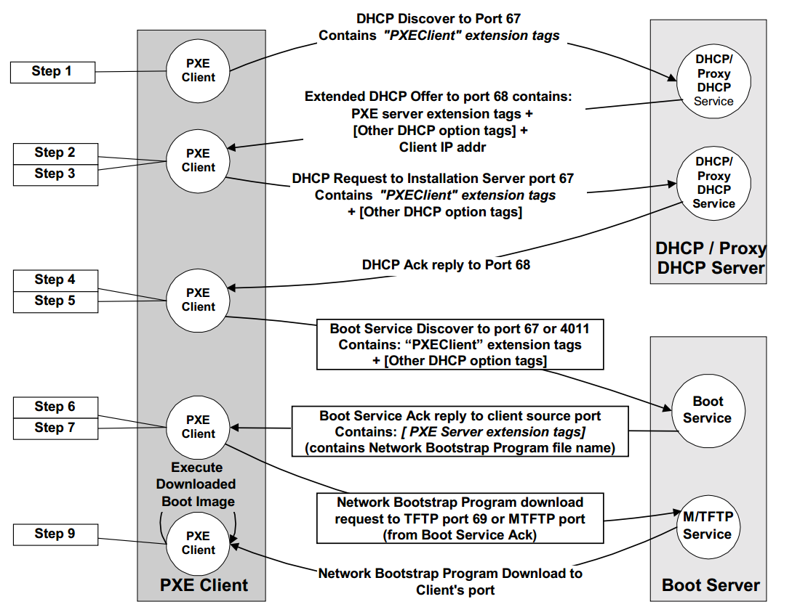

    <h1 style="text-align: center;font-weight: bold">Tugas Unix-and-Linux-sysadmin-notes  
    Workshop Administrasi Jaringan</h1>
    <h4 style="text-align: center;">Dosen Pengampu : Dr. Ferry Astika Saputra, S.T., M.Sc.</h4>

 

    
    <h3 style="text-align: center;">Disusun Oleh : </h3>
    

        <strong>Roihanah Inayati Bashiroh</strong> 
        <strong>3123500005 / 2 D3 IT A</strong> 
    

<h3>Politeknik Elektronika Negeri Surabaya Departemen Teknik
Informatika Dan Komputer Program Studi Teknik Informatika 2024/2025</h3>
    

    

# Chapter 6: Software Installation and Management

## Daftar Isi

- [Operating System Installation](#operating-system-installation)
- [Installation from the network](#installation-from-the-network)
- [Linux Package Management Systems](#linux-package-management-systems)
- [High-Level Package Management](#high-level-package-management)
- [package repositories](#package-repositories)
- [APT: Advanced Package Tool](#apt-advanced-package-tool)
- [yum: Yellowdog Updater, Modified](#yum-yellowdog-updater-modified)
- [Software localization and configuration](#software-localization-and-configuration)
- [Kesimpulan](#kesimpulan)
 
 
 

## Operating System Installation
&nbsp;&nbsp; Proses instalasi sistem operasi Linux dan FreeBSD cukup mudah. Pada mesin fisik, instalasi bisa dilakukan melalui CD, DVD, atau USB. Sedangkan pada mesin virtual, menggunakan file ISO. Instalasi menjadi lebih sederhana karena adanya aplikasi GUI yang memandu langkah-langkahnya.
 
 
 

## Installation from the network
&nbsp;&nbsp; Instalasi sistem operasi melalui jaringan digunakan untuk menginstal OS pada banyak komputer secara otomatis tanpa media fisik. Metode ini umum di pusat data dan cloud karena lebih cepat dan efisien. Proses ini menggunakan **DHCP** dan **TFTP** untuk booting awal, lalu mengambil file instalasi melalui **HTTP**, **FTP**, atau **NFS** dari server jaringan.

&nbsp;&nbsp; Instalasi otomatis sepenuhnya bisa dilakukan dengan **PXE (Preboot eXecution Environment)**, standar dari Intel yang memungkinkan komputer boot melalui kartu jaringan tanpa sistem operasi. PXE berfungsi seperti OS kecil yang ada di ROM kartu jaringan dan bekerja sama dengan BIOS untuk booting tanpa perlu driver khusus.
 

 
 
 

## Linux Package Management Systems
Terdapat dua format paket umum pada sistem Linux:

- **RPM**: Digunakan oleh Red Hat, CentOS, SUSE, Amazon Linux, dan distribusi lainnya.
- **.deb**: Digunakan oleh Debian dan Ubuntu.

Kedua format ini memiliki fungsi yang mirip. 

Untuk mengelola paket:  
- RPM menggunakan perintah **rpm**, sedangkan  
- .deb menggunakan **dpkg**.  

Di tingkat yang lebih tinggi, terdapat alat otomatisasi:  
- **yum** digunakan untuk RPM.  
- **APT (Advanced Package Tool)** digunakan untuk .deb, tetapi juga bisa digunakan untuk RPM.

&nbsp;&nbsp; Alat ini membantu dalam menemukan, mengunduh, dan memperbarui paket secara otomatis dengan menganalisis dependensi antar paket.
 
 
 

## High-Level Package Management
&nbsp;&nbsp; Alat manajemen paket tingkat tinggi adalah alat yang paling sering Anda gunakan. Alat ini memungkinkan Anda menginstal, menghapus, dan memutakhirkan paket. Alat ini juga memungkinkan Anda mencari paket dan membuat daftar paket yang terinstal di sistem Anda.
 
 
 

## Package repositories
&nbsp;&nbsp; Repositori paket pada Linux berisi software yang dikelola oleh distributor dan terhubung dengan sistem manajemen paket. Konfigurasi default biasanya terhubung ke server web atau FTP resmi milik distributor.

- **Release**: Kumpulan paket perangkat lunak dalam satu versi.
- **Component**: Bagian dari perangkat lunak dalam suatu release.
- **Architecture**: Jenis perangkat keras yang dapat menjalankan paket, seperti arsitektur **i386** pada Fedora 20.
 
 
 

## APT: Advanced Package Tool
&nbsp;&nbsp; APT (**Advanced Package Tool**) adalah sekumpulan alat untuk mengelola paket di sistem berbasis Debian, termasuk Ubuntu. APT digunakan untuk instalasi, pembaruan, dan penghapusan paket. 

Beberapa alat dalam APT:
- **apt-get**: Mengelola instalasi, pembaruan, dan penghapusan paket.
- **apt-cache**: Mencari dan menampilkan informasi paket di cache.
- **apt-file**: Mencari file di dalam paket.
- **apt-show-versions**: Menampilkan versi paket yang tersedia.
- **aptitude**: Antarmuka tingkat tinggi untuk manajemen paket.
- **apt-mirror**: Membuat salinan repository paket.

**Catatan:** Pada sistem Ubuntu, disarankan untuk mengabaikan penggunaan **dselect** sebagai antarmuka manajemen paket.
 
 
 

## yum: Yellowdog Updater, Modified 
&nbsp;&nbsp; **Yum** (Yellowdog Updater, Modified) adalah manajer paket untuk sistem Linux berbasis **RPM**. Yum digunakan untuk **mengelola paket** seperti instalasi, pembaruan, dan penghapusan dengan **resolusi dependensi otomatis**. Yum dapat mengelola paket dari **repository** maupun secara langsung melalui **command line**.
 
 
 

## Software localization and configuration
&nbsp;&nbsp; Lokalisasi dan konfigurasi software penting dalam administrasi sistem, baik di lingkungan lokal maupun cloud. Penanganan lokalisasi secara terstruktur dan dapat diulang membantu mencegah sistem unik (snowflake systems) yang sulit dipulihkan saat terjadi insiden besar.