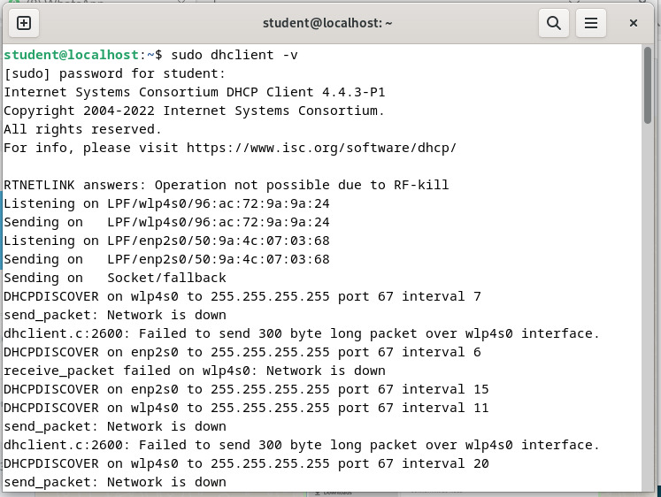
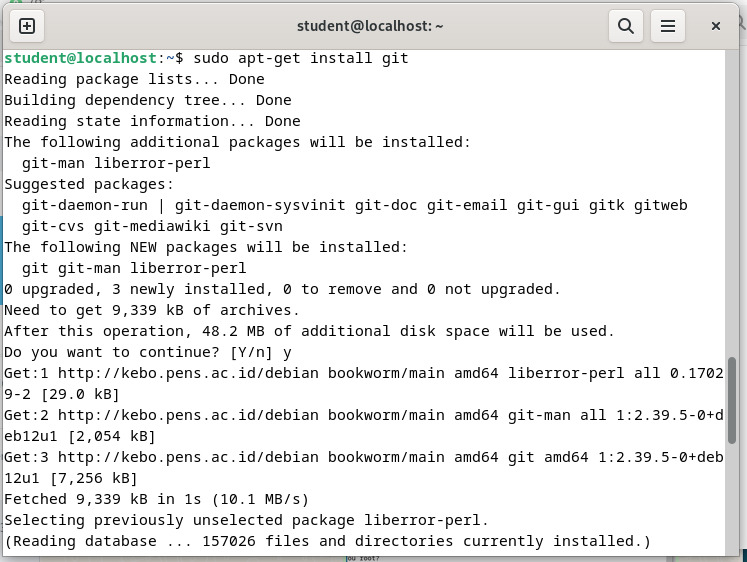
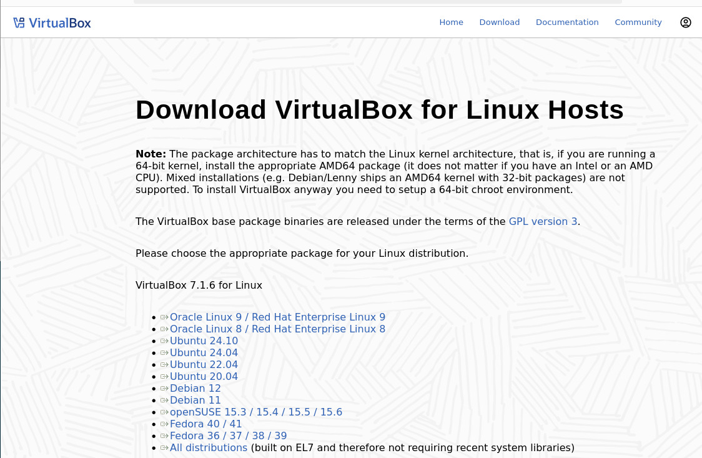
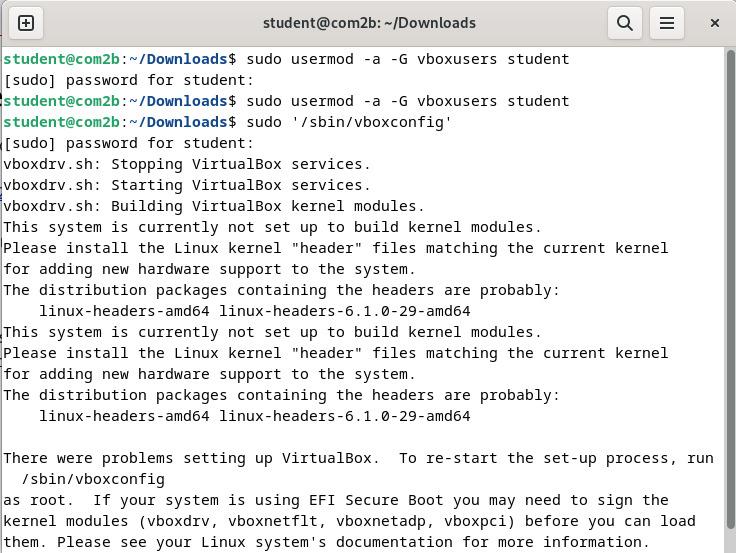
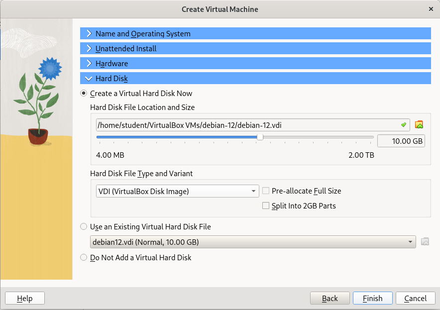
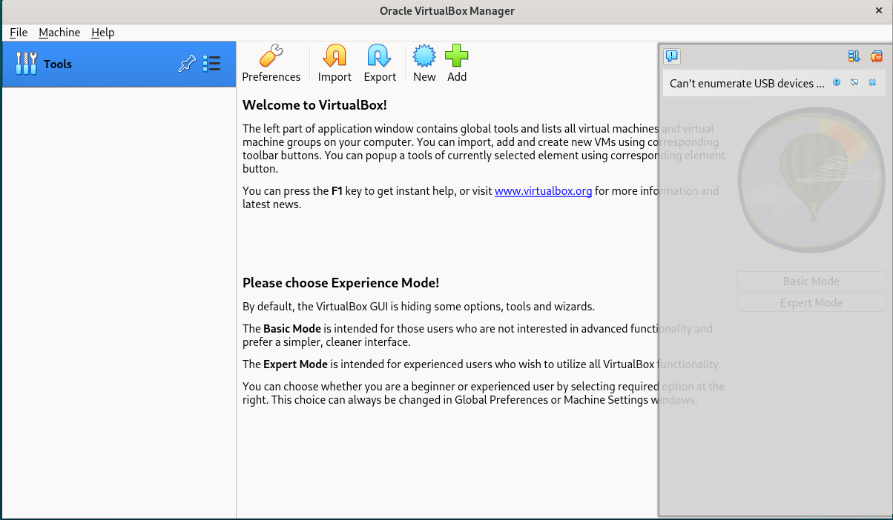
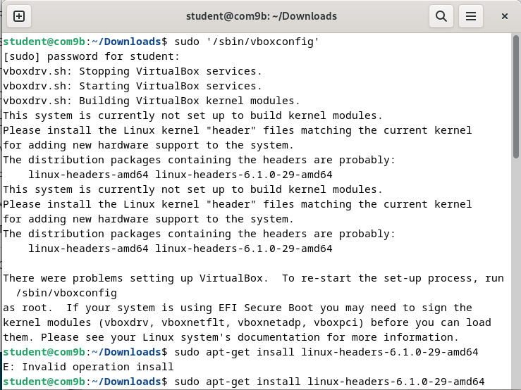
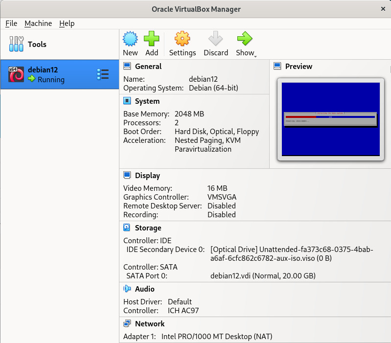
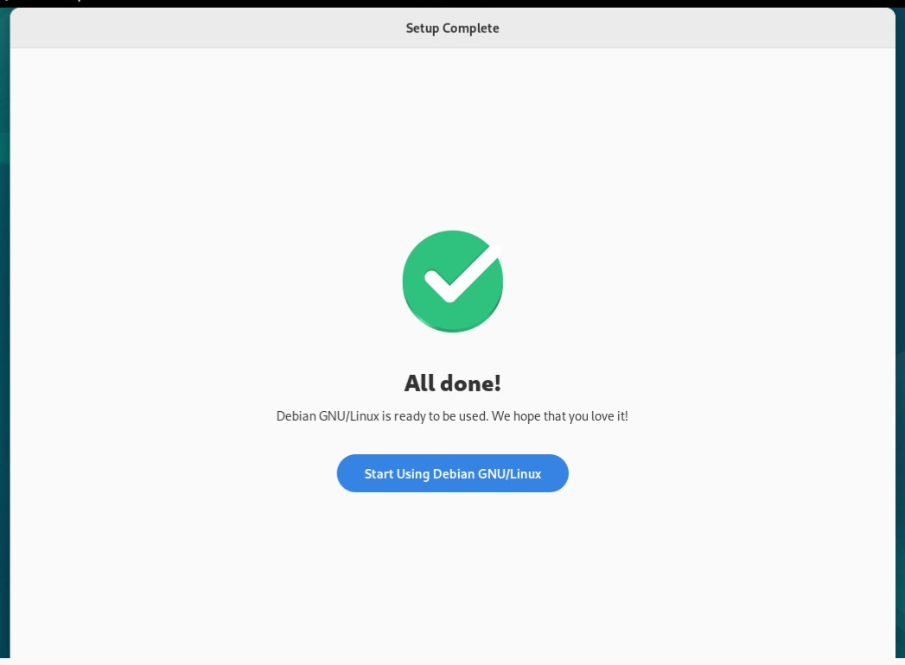

<div align="center">
    <h1 style="text-align: center;font-weight: bold">Tugas Installation Debian di Computer Lab<br><br>
    Workshop Administrasi Jaringan</h1>
    <h4 style="text-align: center;">Dosen Pengampu : Dr. Ferry Astika Saputra, S.T., M.Sc.</h4>
</div>
<br />
<div align="center">
    
    <h3 style="text-align: center;">Disusun Oleh : </h3>
    <p style="text-align: center;">
        <strong>Roihanah Inayati Bashiroh</strong><br>
        <strong>3123500005 / 2 D3 IT A</strong><br>
    </p>

<h3>Politeknik Elektronika Negeri Surabaya<br>Departemen Teknik
Informatika Dan Komputer<br>Program Studi Teknik Informatika<br>2024/2025</h3>
    <hr>
    <hr>
</div>


<h3>Solve LAN Wired Not Connected</h3>

<br>
```bash
sudo dhclient -v
```

Perintah `sudo dhclient -v` digunakan untuk meminta atau memperbarui alamat IP dari server DHCP dengan menampilkan output secara rinci.
<br>
<br>
<br>
<h3>Clone Github</h3>

<br>
```bash
sudo apt-get install git
```
<br>
<br>

<br>
```bash
git clone https://github.com/ferryastika/unix-and-linux-sysadmin-notes.git
```
<br>
<br>
<br>
<h3>Download Virtual Box</h3>


https://www.virtualbox.org/wiki/Linux_Downloads

<br>
<br>
<br>
<h3>Download ISO Debian 12</h3>


https://www.debian.org/download
<br>
<br>
<br>
<h3>Install VirtualBox</h3>


```bash
sudo dpkg -i virtualbox-7.1_7.1.6-167084~Debian~bookworm_amd64.deb
```
<br>
<br>
<br>
<h3>Error saat membuka Virtual Box</h3>

<br>

Dengan perintah di bawah ini, dapat menambahkan user yang sedang login dalam grup vboxusers.
```bash
sudo usermod -a -G vboxusers student
```

<br>
<br>
<br>
<h3>Add New Virtual Machine</h3>

<br>
<br>
<br>
<br>
<br>
<br>
<br>
<h3>Error pada Kernel</h3>

<br>
<br>
<br>
Solve nya di bawah ini:
```bash
sudo apt update
sudo apt install dkms build-essential linux-headers-$(uname -r)
sudo /sbin/vboxconfig
sudo apt-get install linux-headers-6.1.0-29-amd64
```

<br>

<br>
<br>
<br>
<h3>Run Virtual Machine</h3>

<br>

<br>
<br>
<br>
<h3>Virtual Box siap digunakan</h3>

<br>
