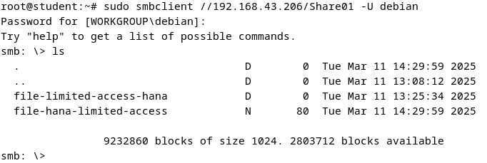
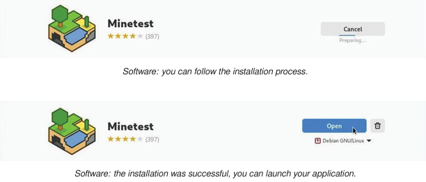

<div align="center">
    <h1 style="text-align: center;font-weight: bold">Tugas Konfigurasi NTP & Samba<br>Workshop Administrasi Jaringan</h1>
    <h4 style="text-align: center;">Dosen Pengampu : Dr. Ferry Astika Saputra, S.T., M.Sc.</h4>
</div>
<br />
<div align="center">
    
    <h4 style="text-align: center;">Disusun Oleh : </h4>
    <p style="text-align: center;">
        <strong>Roihanah Inayati Bashiroh</strong><br>
        <strong>3123500005 / 2 D3 IT A</strong><br>
    </p>

<h3>Politeknik Elektronika Negeri Surabaya<br>Departemen Teknik
Informatika Dan Komputer<br>Program Studi Teknik Informatika<br>2024/2025</h3>
    <hr>
    <hr>
</div>


## Daftar Isi
- [Instalasi NTP Client](#instalasi-ntp-client)
- [Instalasi dan Konfigurasi Samba](#instalasi-dan-konfigurasi-samba)
- [Rangkuman Package Manager](#rangkuman-package-manager)
- [Referensi](#referensi)


### Instalasi NTP Client

1. Install dan konfigurasi NTP client agar host anda mempunyai waktu yang sinkron dengan NTP server di Indonesia.
2. Nama NTP server yang harus dirujuk adalah ntp server Indonesia

Referensi:
1. https://www.server-world.info/en/note?os=Debian_12&p=ntp&f=1 
2. https://www.ntppool.org/en/zone/id  

Package terkait: 
- ntp
- ntpssec

### Konfigurasi Network Time Protocol (NTP)
Network Time Protocol (NTP) adalah protokol internet yang digunakan untuk melakukan sinkronisasi dengan sumber waktu jam komputer dalam suatu jaringan.

### NTPSec
NTPsec adalah versi yang lebih aman dari Network Time Protocol (NTP). NTPsec merupakan percabangan dari implementasi referensi NTP yang diperkuat keamanannya.

Berikut langkah-langkah konfigurasi NTPsec di Linux:
### 1. Instalasi NTPSec

<br>

### 2. Konfigurasi Server NTPsec

<br>

### 3. Restart dan Verifikasi Status NTPsec

<br>


## Instalasi dan konfigurasi Samba

1. Membuat public shared folder. Folder tersebut harus bisa diakses melalui Windows Client dan Linux Client via file manager.
2. Membuat limited shared Folder.
3. Akses ke folder Share dari CLI client.

Referensi:
https://www.server-world.info/en/note?os=Debian_12&p=samba&f=1

Package terkait:
- samba
- smbclient
- cifs-tools

### Instalasi dan Konfigurasi Samba
Samba adalah software open-source yang memungkinkan sistem operasi berbasis Unix/Linux untuk berbagi file dan printer dengan sistem Windows melalui protokol SMB/CIFS (Server Message Block/Common Internet File System). Dengan Samba, Linux dapat bertindak sebagai file server yang dapat diakses oleh perangkat Windows dan sebaliknya.

Berikut langkah-langkah install dan konfigurasi samba di Debian:

### 1. Install Samba

<br>


### Percobaan Fully Access
### 2. Konfigurasi Samba

<br>

<br>

### 3. Buat File Direktori Sharing

<br>

### 4. Isi file -hana

<br>

### 5. Percobaan dari laptop lain

<br>


### Percobaan Limited Access
### 1. Konfigurasi pada samba

<br>

### 2. Membuat sebuah file untuk dibagikan ke direktori /home/share01

<br>

### 3. Menambahkan user baru

<br>

### 4. Menambahkan user baru ke grup hanagrup

<br>

### 5. Menambahkan user valid baru ke samba

<br>

### 6. Percobaan akses di host

<br>

### 7. Percobaan akses di laptop lain

<br>

<br>

### 8. Percobaan akses lewat CLI

<br>


## Rangkuman Package Manager

(Bahan ada di Materi ethol Debian 12 SysAdmin)
Di tiap nomor buat langkah-langkah instalasi, konfigurasi dan hasil (output) dari perintah-perintah terkait yang memastikan layanan dapat digunakan dengan baik.

### Package management
Package management adalah proses yang digunakan untuk mengelola perangkat lunak di sistem operasi berbasis Debian, termasuk instalasi, konfigurasi, dan penghapusan paket perangkat lunak.

<br>

Berikut adalah langkah-langkah instalasi, konfigurasi, dan hasil dari perintah-perintah terkait yang memastikan layanan dapat digunakan dengan baik:

### 1. Searching an Application
Sebelum menginstal aplikasi, kita perlu mencarinya di repositori package manager. Berikut adalah langkah-langkahnya:

a. Instalasi (Persiapan)
- Pastikan package manager sudah terinstal.
- Perbarui daftar paket agar mendapatkan daftar terbaru dari repositori.
```
sudo apt update   # Debian/Ubuntu
sudo dnf check-update  # Fedora
sudo yum check-update  # CentOS
sudo pacman -Sy  # Arch Linux
```

b. Pencarian Aplikasi
- Gunakan perintah berikut untuk mencari aplikasi:
```
apt search <nama_aplikasi>  # Debian/Ubuntu
dnf search <nama_aplikasi>  # Fedora
yum search <nama_aplikasi>  # CentOS
pacman -Ss <nama_aplikasi>  # Arch Linux
```

c. Output

<br>


### 2. Installing an Application
Setelah menemukan aplikasi yang ingin diinstal, kita dapat memasangnya menggunakan package manager.

a. Instalasi
- Gunakan perintah berikut untuk menginstal aplikasi:
```
sudo apt install <nama_aplikasi>  # Debian/Ubuntu
sudo dnf install <nama_aplikasi>  # Fedora
sudo yum install <nama_aplikasi>  # CentOS
sudo pacman -S <nama_aplikasi>  # Arch Linux
```

b. Konfigurasi
- Beberapa aplikasi mungkin memerlukan konfigurasi tambahan setelah instalasi.
- Misalnya, mengaktifkan layanan setelah instalasi:
```
sudo systemctl enable --now <nama_layanan>
```

c. Output

<br>

<br>

<br>


### 3. Removing an Application
Jika suatu aplikasi tidak lagi diperlukan, kita bisa menghapusnya.

a. Penghapusan Aplikasi
- Gunakan perintah berikut untuk menghapus aplikasi:
```
sudo apt remove <nama_aplikasi>  # Debian/Ubuntu
sudo dnf remove <nama_aplikasi>  # Fedora
sudo yum remove <nama_aplikasi>  # CentOS
sudo pacman -R <nama_aplikasi>  # Arch Linux
```
- Untuk menghapus dependensi yang tidak diperlukan:
```
sudo apt autoremove  # Debian/Ubuntu
sudo pacman -Rns <nama_aplikasi>  # Arch Linux
```

b. Konfigurasi
- Pastikan file konfigurasi yang tersisa juga dihapus jika tidak dibutuhkan:
```
sudo apt purge <nama_aplikasi>  # Debian/Ubuntu
```

c. Output

<br>


### 4. Upgrading an Application
Pembaruan aplikasi penting untuk mendapatkan fitur terbaru dan perbaikan keamanan.

a. Perbarui Daftar Paket
```
sudo apt update  # Debian/Ubuntu
sudo dnf check-update  # Fedora
sudo yum check-update  # CentOS
sudo pacman -Sy  # Arch Linux
```

b. Perbarui Paket Secara Keseluruhan
```
sudo apt upgrade  # Debian/Ubuntu
sudo dnf upgrade  # Fedora
sudo yum update  # CentOS
sudo pacman -Syu  # Arch Linux
```
- Untuk memperbarui paket tertentu:
```
sudo apt install --only-upgrade <nama_aplikasi>  # Debian/Ubuntu
```

c. Output

<br>

<br>

<br>

<br>


### 5. Modify Package Repositories
Repositori adalah sumber paket yang dapat diubah sesuai kebutuhan.

a. Menambah/Mengubah Repositori
- Debian/Ubuntu: Edit file `/etc/apt/sources.list` dan tambahkan repositori baru.
```
sudo nano /etc/apt/sources.list
```
- Fedora/CentOS: Tambahkan file repositori di `/etc/yum.repos.d/`
```
sudo nano /etc/yum.repos.d/custom.repo
```

b. Mengupdate dan Verifikasi Repositori
```
sudo apt update  # Debian/Ubuntu
sudo dnf repolist  # Fedora
sudo yum repolist  # CentOS
```

c. Output

<br>

<br>

<br>

<br>


### 6. Automatic Updates with Software
Agar sistem tetap up-to-date tanpa harus memperbarui secara manual, kita bisa mengatur pembaruan otomatis.

a. Instalasi Paket untuk Pembaruan Otomatis
```
sudo apt install unattended-upgrades  # Debian/Ubuntu
sudo dnf install dnf-automatic  # Fedora/CentOS
```

b. Konfigurasi Pembaruan Otomatis
- Debian/Ubuntu: Edit file `/etc/apt/apt.conf.d/50unattended-upgrades`
- Fedora/CentOS: Edit file `/etc/dnf/automatic.conf`

c. Mengaktifkan Layanan Pembaruan Otomatis
```
sudo systemctl enable --now unattended-upgrades  # Debian/Ubuntu
sudo systemctl enable --now dnf-automatic.timer  # Fedora
```

d. Output

<br>

<br>
