<div align="center">
    <h1 style="text-align: center;font-weight: bold">Ekosistem Internet dan Konsep DNS<br>Workshop Administrasi Jaringan</h1>
    <h4 style="text-align: center;">Dosen Pengampu : Dr. Ferry Astika Saputra, S.T., M.Sc.</h4>
</div>
<br />
<div align="center">
    
    <h4 style="text-align: center;">Disusun Oleh : </h4>
    <p style="text-align: center;">
        <strong>Roihanah Inayati Bashiroh</strong><br>
        <strong>3123500005 / 2 D3 IT A</strong><br>
    </p>

<h3>Politeknik Elektronika Negeri Surabaya<br>Departemen Teknik
Informatika Dan Komputer<br>Program Studi Teknik Informatika<br>2024/2025</h3>
    <hr>
    <hr>
</div>

## Daftar Isi

- [Ekosistem Internet dan DNS Concept](#ekosistem-internet-dan-dns-concept)
  - [nsswitch](#nsswitch)
  - [Penjelasan Beberapa Layanan](#penjelasan-beberapa-layanan)
  - [File /etc/hosts](#file-etchosts)
  - [Cek IP](#cek-ip)
  - [resolv.conf](#resolvconf)
  - [Test ping www](#test-ping-www)
  - [root.hints](#roothints)
- [Instalasi & Konfigurasi bind9](#instalasi--konfigurasi-bind9)
  - [Konfigurasi Jaringan Internal](#konfigurasi-jaringan-internal)
  - [Konfigurasi dan Penyesuaian BIND](#konfigurasi-dan-penyesuaian-bind)
  - [Konfigurasi Zona DNS di BIND](#konfigurasi-zona-dns-di-bind)
  - [Konfigurasi opsi BIND untuk IPv4](#konfigurasi-opsi-bind-untuk-ipv4)
  - [Konfigurasi Zone Files](#konfigurasi-zone-files)
  - [BIND: Verify Resolution](#bind-verify-resolution)
  - [Konfigurasi DNS Client](#konfigurasi-dns-client)
  - [DNS Query menggunakan DiG](#dns-query-menggunakan-dig)
  - [Reverse DNS Lookup](#reverse-dns-lookup)
- [Referensi](#referensi)

<br>
<br>
<br>


## Ekosistem Internet dan DNS Concept

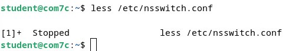<br>

### nsswitch

Pada sistem Linux seperti Debian, file `/etc/nsswitch.conf` berfungsi sebagai konfigurasi Name Service Switch (NSS). File ini menentukan mekanisme pencarian informasi dalam sistem, termasuk pencarian pengguna, grup, dan host.

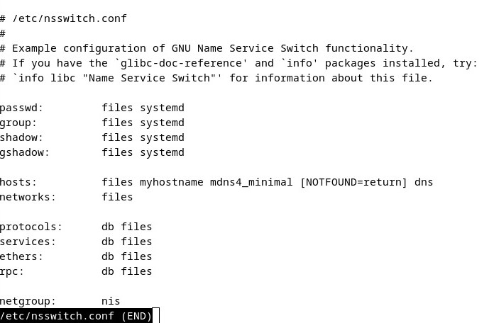<br>

### Penjelasan Beberapa Layanan

- **passwd, group, dan shadow**: Digunakan untuk mendapatkan informasi terkait pengguna dan grup. Jika opsi **files** digunakan, data akan diambil dari `/etc/passwd`, `/etc/group`, dan `/etc/shadow`.
- **hosts**: Menentukan cara pencarian alamat IP berdasarkan nama host. Jika menggunakan **files**, sistem akan mengecek `/etc/hosts` terlebih dahulu sebelum menggunakan **dns**.
- **networks, protocols, services, ethers, dan rpc**: Berisi informasi jaringan, protokol, layanan, serta konfigurasi lainnya dalam sistem.

### File /etc/hosts

File `/etc/hosts` digunakan untuk melakukan pemetaan nama host ke alamat IP secara lokal tanpa perlu menggunakan layanan DNS. Sistem akan lebih dulu mencari entri dalam file ini sebelum mencoba resolusi domain melalui layanan eksternal.

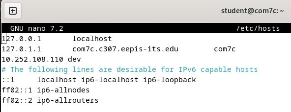<br>

Untuk menambahkan pemetaan, buka file dengan hak akses root:

```bash
sudo nano /etc/hosts
```

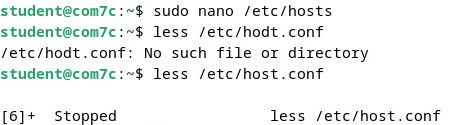<br>

Tambahkan entri seperti berikut:

```bash
10.252.108.110    dev
```

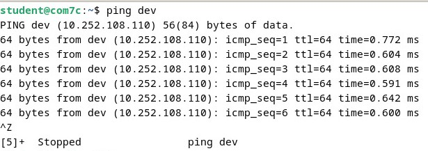<br>

### Cek IP

Untuk mengetahui alamat IP yang digunakan, jalankan perintah berikut:

```bash
ip a
```

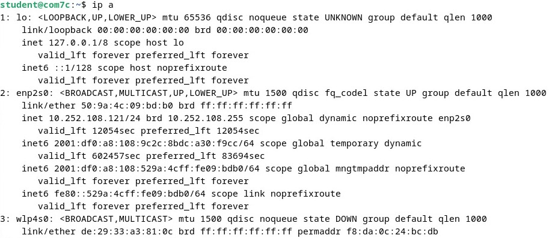<br>

### resolv.conf

File `/etc/resolv.conf` digunakan untuk mengonfigurasi server DNS yang digunakan dalam pencarian nama domain. Isi file dapat diperiksa dengan perintah berikut:

```bash
sudo less /etc/resolv.conf
```

Dalam file ini, **nameserver** menentukan alamat IP server DNS yang digunakan, dan **search** mengatur domain yang akan dicari ketika hanya sebagian nama host yang diberikan.

### Test ping www

Untuk menguji apakah konfigurasi DNS berfungsi, gunakan perintah berikut:

```bash
ping www
```

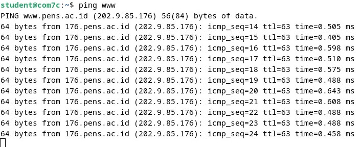<br>


### root.hints

File `/usr/share/dns/root.hints` berisi daftar server root DNS yang digunakan oleh resolver rekursif untuk menemukan server otoritatif suatu domain. File ini digunakan oleh server DNS seperti BIND untuk menyelesaikan permintaan yang tidak tersedia dalam cache atau zona lokal.

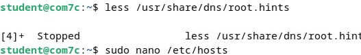<br>

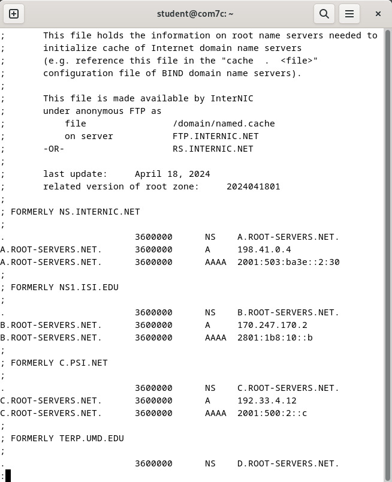<br>


---

## **Instalasi & Konfigurasi bind9**

### **Konfigurasi Jaringan Internal**

Install bind9

Command untuk install bind9, sebelum itu masuk ke root

```bash
root@dlp:~# apt -y install bind9 bind9utils
```

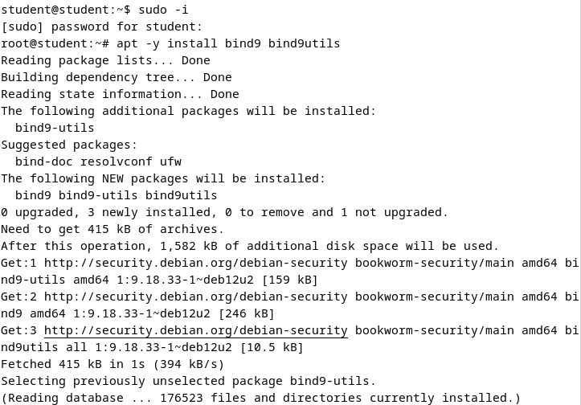<br>

### **Konfigurasi dan Penyesuaian BIND**

Menambahkan `named.conf.internal-zones`, file konfigurasi baru, ke file utama konfigurasi BIND `/etc/bind/named.conf.`

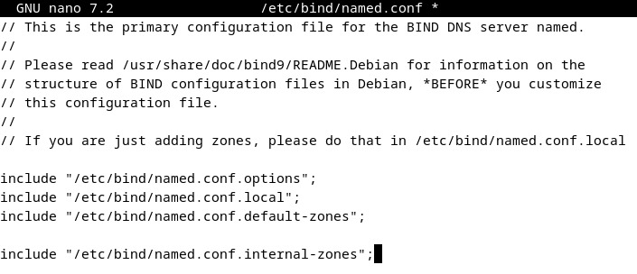<br>

### Konfigurasi pada `/etc/bind/named.conf.options`

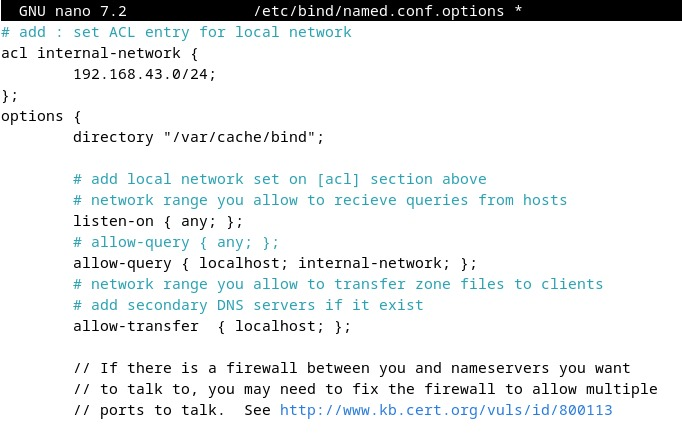<br>

Konfigurasi ACL **internal-network** untuk jaringan `192.168.80.0/24` menentukan siapa yang dapat mengakses layanan DNS, di mana hanya **localhost** dan jaringan internal yang diizinkan melakukan query (`allow-query`), sementara transfer zona hanya diperbolehkan untuk **localhost** (`allow-transfer`). Pencarian rekursif diaktifkan (`recursion yes`) untuk resolusi domain eksternal, validasi DNSSEC diatur otomatis (`dnssec-validation auto`), dan BIND dikonfigurasi agar menerima koneksi IPv6 (`listen-on-v6 { any; }`).

### **Konfigurasi Zona DNS di BIND**

<br>

**1. Zona Forward (kelompok4.home)**

Zona ini digunakan untuk menerjemahkan nama domain ke alamat IP dan disimpan dalam file `/etc/bind/kelompok4.home.lan`. Bertindak sebagai **master (utama)**, sehingga server ini menjadi sumber resmi data DNS untuk domain tersebut. Selain itu, update dinamis tidak diizinkan dengan konfigurasi `allow-update { none; };`.

**2. Zona Reverse (80.168.192.in-addr.arpa)**

Zona ini berfungsi untuk menerjemahkan alamat IP ke nama domain (**reverse lookup**) dan disimpan dalam file `/etc/bind/80.168.192.db`. Seperti zona forward, zona ini juga bertindak sebagai **master**, dengan update dinamis yang dinonaktifkan.

### **Konfigurasi opsi BIND untuk menggunakan hanya IPv4 dan menonaktifkan IPv6.**

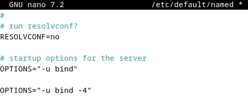<br>

Untuk mengonfigurasi BIND agar hanya menggunakan IPv4, edit file `/etc/default/named` dan tambahkan opsi `OPTIONS="-u bind -4"`. Opsi ini memastikan BIND berjalan sebagai pengguna `bind` dan hanya menggunakan IPv4, mengabaikan IPv6 untuk menghindari kemungkinan error pada jaringan yang tidak mendukung IPv6.

### **Konfigurasi Zone Files**

Konfigurasi **forward lookup** pada BIND DNS Server untuk jaringan **192.168.80.0/24** dengan domain **kelompok4.home** memungkinkan server menerjemahkan nama domain ke alamat IP dengan menetapkan file zona sebagai **master** dan mendefinisikan pemetaan nama host.

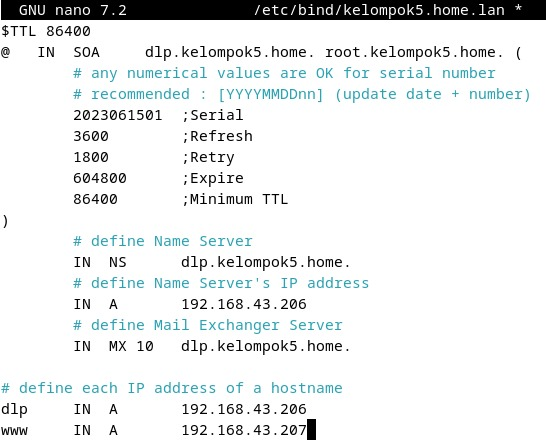<br>

Konfigurasi **reverse lookup** pada BIND DNS Server untuk jaringan **192.168.80.0/24** dengan domain **kelompok4.home** dilakukan dengan membuat file zona `/etc/bind/80.168.192.db`, mendaftarkannya sebagai **master** di `/etc/bind/named.conf.local`, lalu memverifikasi dan merestart BIND agar perubahan diterapkan.

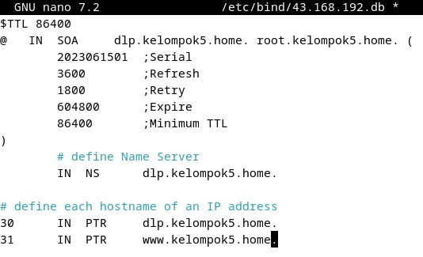<br>

### **BIND: Verify Resolution**

Restart BIND untuk menerapkan perubahan dengan command 

```bash
root@dlp:~# systemctl restart named
```

### **Konfigurasi DNS Client untuk menggunakan DNS Server sendiri**

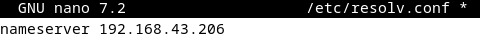<br>

Sistem Linux menggunakan file /etc/resolv.conf untuk memilih DNS server mana yang akan digunakan untuk melakukan query DNS, misalnya menyelesaikan domain ke IP atau sebaliknya.

Dengan mengedit **`/etc/resolv.conf`** dan mengubah **nameserver** menjadi **192.168.80.193**, berarti:

- Mengatur sistem supaya pakai **DNS Server sendiri** (BIND di **192.168.80.193**)
- Prioritaskan pencarian DNS ke **server lokal dulu**, sebelum ke DNS eksternal
- Bikin sistem bisa resolve **domain lokal** yang cuma dikenali oleh DNS internal

### **DNS Query menggunakan DiG (Domain Information Groper) untuk Forward Lookup**

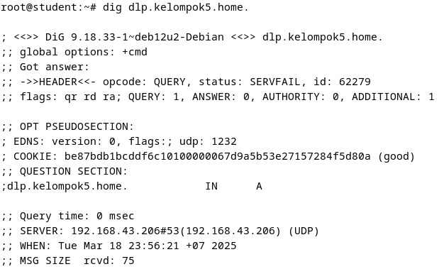<br>

Perintah di atas digunakan untuk menggunakan DNS Server yang telah dikonfigurasi untuk melihat resolusi nama domain ke alamat IP.

### **Reverse DNS Lookup**

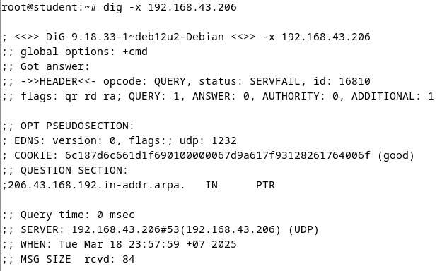<br>

Nama domain yang terkait dengan alamat IP tertentu dapat ditemukan dengan menggunakan perintah di atas untuk melakukan pencarian balik.

### Referensi
[DNS Concept](https://www.biznetgio.com/news/apa-itu-dns-pengertian-fungsi-cara-kerja-dan-teknologi-anycast-dns)

