

    <h1 style="text-align: center;font-weight: bold">Konfigurasi pada VM1 dan VM2 Workshop Administrasi Jaringan</h1>
    <h4 style="text-align: center;">Dosen Pengampu : Dr. Ferry Astika Saputra, S.T., M.Sc.</h4>

 

    
    <h4 style="text-align: center;">Disusun Oleh : </h4>
    

        <strong>Roihanah Inayati Bashiroh</strong> 
        <strong>3123500005 / 2 D3 IT A</strong> 
    

<h3>Politeknik Elektronika Negeri Surabaya Departemen Teknik
Informatika Dan Komputer Program Studi Teknik Informatika 2025/2026</h3>
    

    

---

## Daftar Isi

- [Konfigurasi pada VM 1 (Server)](#konfigurasi-vm-1)  
- [Konfigurasi NTPSec](#konfigurasi-ntpsec-vm-1)  
- [Konfigurasi File Samba](#konfigurasi-samba-vm-1)  
- [Konfigurasi DNS Server](#konfigurasi-dns-server-vm-1)  
- [Konfigurasi pada VM 2 (Client)](#konfigurasi-vm-2)  
- [Kesimpulan](#kesimpulan)  

Dalam praktikum ini, digunakan dua buah Virtual Machine (VM) yang masing-masing berperan sebagai **Client** dan **Server**.

### Konfigurasi VM 1 (Server)

VM 1 bertindak sebagai server. Konfigurasi jaringannya menggunakan dua network adapter, yaitu:

- **Bridge Adapter** yang digunakan untuk akses internet.  
- **Internal Network** yang digunakan sebagai media komunikasi langsung dengan VM Client.

VM 1 juga difungsikan sebagai **gateway** agar client dapat terkoneksi ke internet. Selain itu, VM ini dilengkapi dengan layanan seperti **Samba** untuk berbagi file, **NTPSec** untuk sinkronisasi waktu, dan **Bind9** sebagai DNS lokal.

#### Konfigurasi Network Adapter

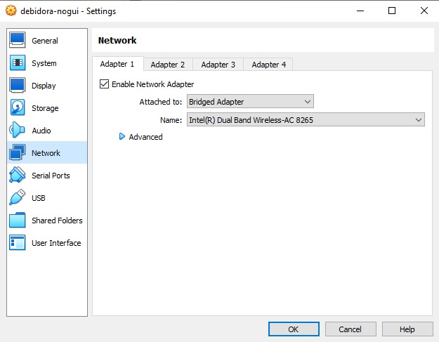   
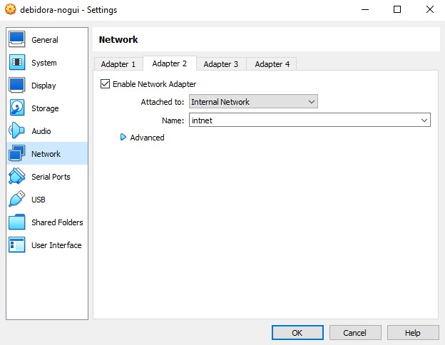  

Server dikonfigurasi menggunakan dua adapter: **Bridged Adapter** untuk mengakses internet melalui host, dan **Internal Network** untuk komunikasi dengan VM 2. Adapter ini memastikan server dapat berfungsi sebagai penghubung antara client dan internet.

#### Konfigurasi IP Address untuk Koneksi Internal antar VM

1. Mengecek IP Address  
   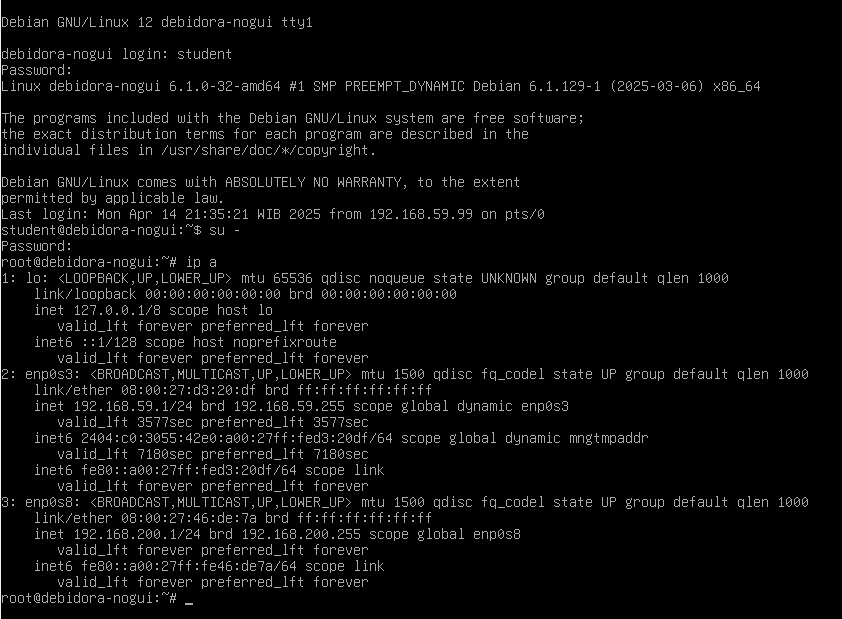  

2. Mengakses terminal VM 1 via SSH  
   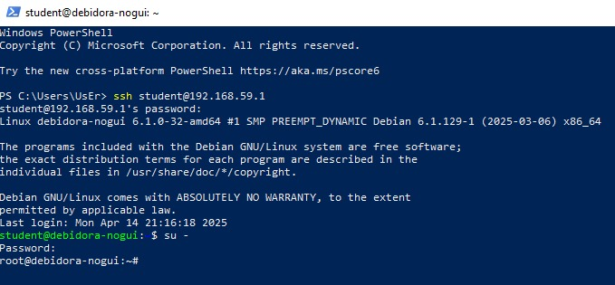  

   Untuk melakukan konfigurasi dari host ke server, koneksi dilakukan secara remote menggunakan protokol SSH (Secure Shell).

3. Menambahkan konfigurasi pada file `/etc/network/interfaces`  
   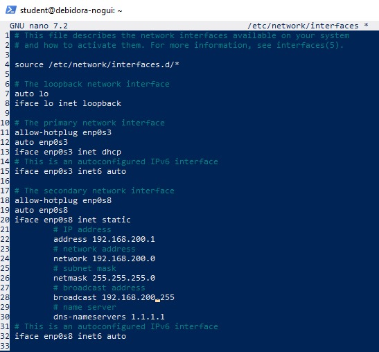  

   Setiap adapter akan memiliki nama unik. Dalam konfigurasi ini, `enp0s3` digunakan untuk koneksi DHCP (internet), sedangkan `enp0s8` dikonfigurasi secara statis dan difungsikan sebagai gateway ke client.

#### Mengaktifkan IP Forwarding pada Server

1. Edit file `/etc/sysctl.conf`  
   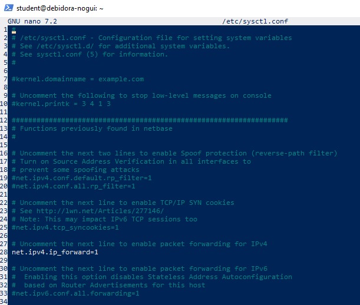  

   Untuk membuat server bisa meneruskan paket jaringan (routing), pengaturan `net.ipv4.ip_forward` harus diaktifkan.

2. Melakukan validasi konfigurasi  
   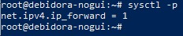  

#### Konfigurasi iptables

1. Instalasi paket iptables dan iptables-persistent  
   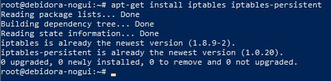  

2. Mengatur aturan iptables pada file `/etc/iptables/rules.v4`  
   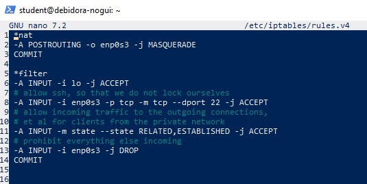  

3. Menyimpan konfigurasi dengan perintah `iptables-restore`  
   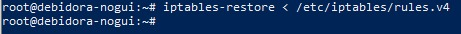  

#### Reboot

Setelah semua konfigurasi selesai, jalankan perintah `reboot` untuk memuat ulang sistem.

---

### Konfigurasi NTP (NTPSec) pada VM 1

1. Instalasi paket ntpsec  
   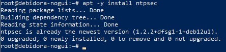  

2. Mengatur konfigurasi server NTP  
   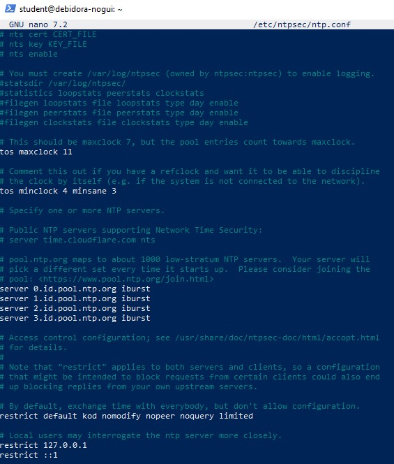  

3. Restart layanan ntpsec dengan perintah `systemctl restart ntpsec`  
   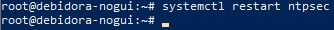  

4. Mengecek status layanan NTP  
   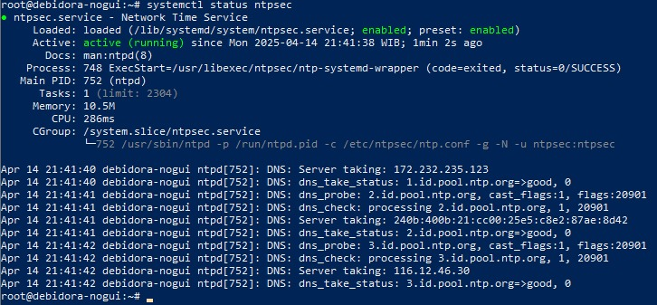  

5. Melakukan validasi koneksi NTP  
   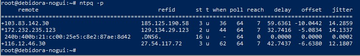  

---

### Konfigurasi File Samba pada VM 1

1. Instalasi paket samba  
   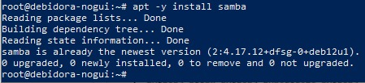  

2. Membuat folder share dan mengatur permission  
   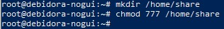  

3. Menambahkan konfigurasi pada file `/etc/samba/smb.conf`  
   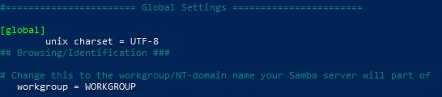    
   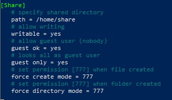  

4. Me-restart layanan samba  
   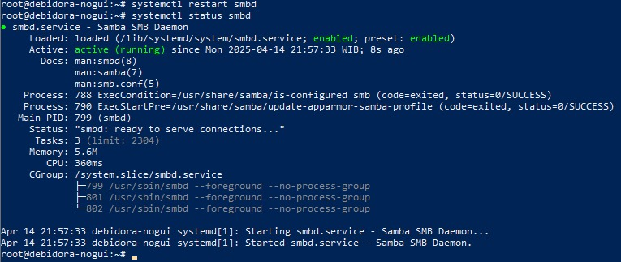  

---

### Konfigurasi DNS Server pada VM 1 

1. Instalasi paket DNS server  
   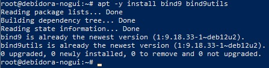  

2. Menambahkan konfigurasi pada file `/etc/bind/named.conf`  
   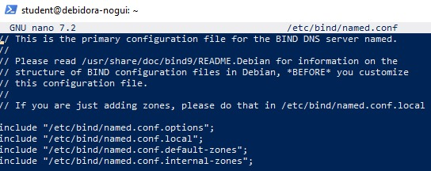  

3. Mengedit file opsi `/etc/bind/named.conf.options`  
   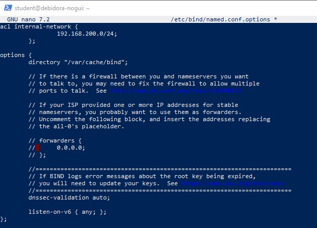  

4. Membuat internal zone di `/etc/bind/named.conf.internal-zones`  
   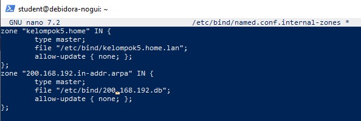  

5. Menambahkan opsi `-4` pada file `/etc/default/named`  
   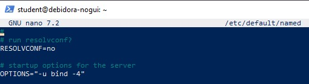  

6. Membuat file konfigurasi domain lokal  
   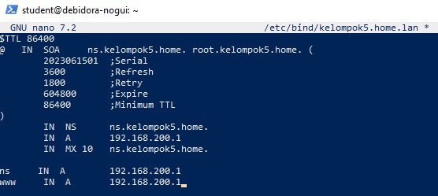  

7. Membuat file konfigurasi berdasarkan IP address  
   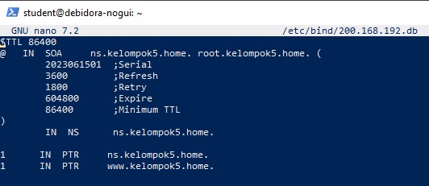  

---

### Konfigurasi pada VM 2

VM 2 diatur agar memiliki alamat IP dalam satu subnet dengan interface internal dari VM 1 (enp0s8), sehingga koneksi antar VM dapat berjalan dengan lancar.

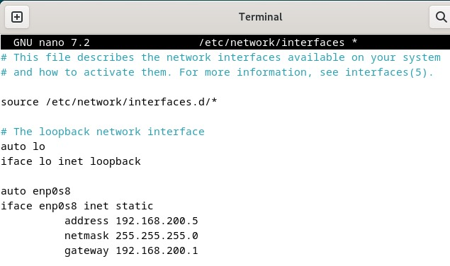  

#### Melakukan ping ke gateway server

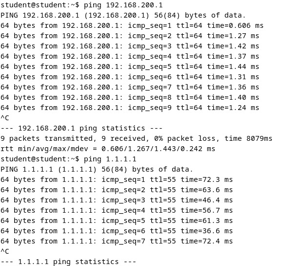  

#### Menguji akses folder Samba dari Client

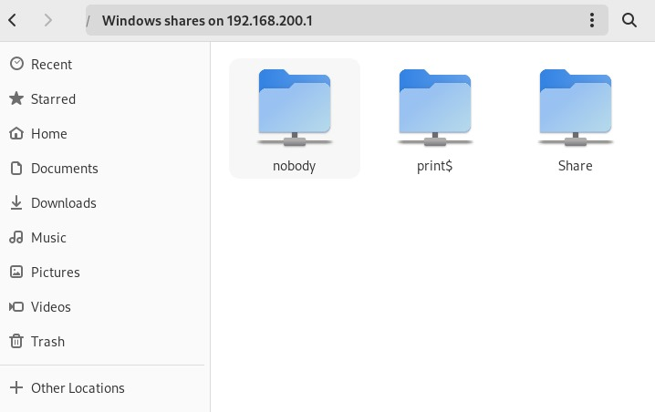  

Jika folder **Share** muncul di file manager client, maka konfigurasi file sharing dengan Samba telah berhasil dilakukan.

#### Mengecek DNS Server (Client) menggunakan domain name

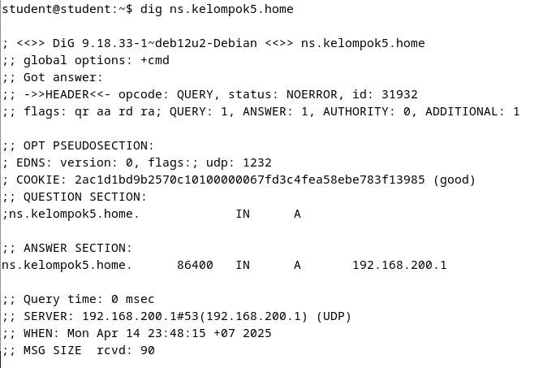 

Hasil dari perintah `dig` menunjukkan bahwa domain `ns.kelompok5.home` berhasil dikenali dan diterjemahkan ke alamat IP yang sesuai, tanpa error.

#### Mengecek DNS Server (Client) menggunakan IP address (Reverse DNS)

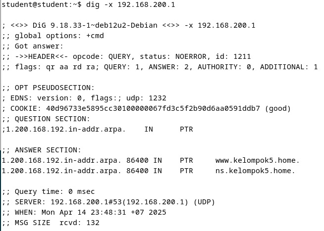 

Perintah `dig -x 192.168.3.1` menunjukkan hasil yang sesuai dengan domain `ns.kelompok5.home`, yang berarti PTR record sudah dikonfigurasi dengan benar.

---

## Kesimpulan

Melalui praktikum ini, saya telah berhasil melakukan serangkaian konfigurasi layanan pada VM1 yang berperan sebagai server serta VM2 sebagai client. Pada **VM1**, konfigurasi jaringan dilakukan dengan dua adapter untuk memastikan konektivitas ke internet dan jaringan internal. Server diatur agar dapat menjadi gateway bagi client melalui pengaktifan IP forwarding dan pengaturan iptables.

Pemasangan dan pengaturan **NTPSec** memungkinkan sinkronisasi waktu agar semua sistem dalam jaringan memiliki waktu yang konsisten dan akurat, yang penting untuk keamanan serta manajemen sistem. **Layanan Samba** berhasil disiapkan untuk memfasilitasi berbagi file antara server dan client secara mudah melalui jaringan lokal. Hal ini dibuktikan dengan client yang dapat mengakses folder shared dari file manager-nya.

Selanjutnya, konfigurasi **DNS Server menggunakan Bind9** juga sukses dilakukan. Server mampu menerjemahkan domain lokal menjadi alamat IP dan sebaliknya, yang ditunjukkan dari hasil tes DNS forward dan reverse lookup tanpa error. Pada sisi **VM2 sebagai client**, koneksi ke server berjalan lancar berkat pengaturan IP statis yang sesuai jaringan, serta berhasil mengakses layanan-layanan yang telah disediakan oleh server.

---

