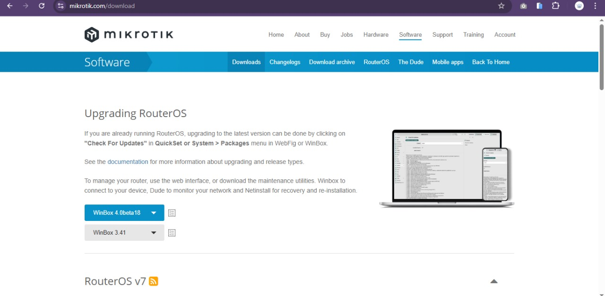
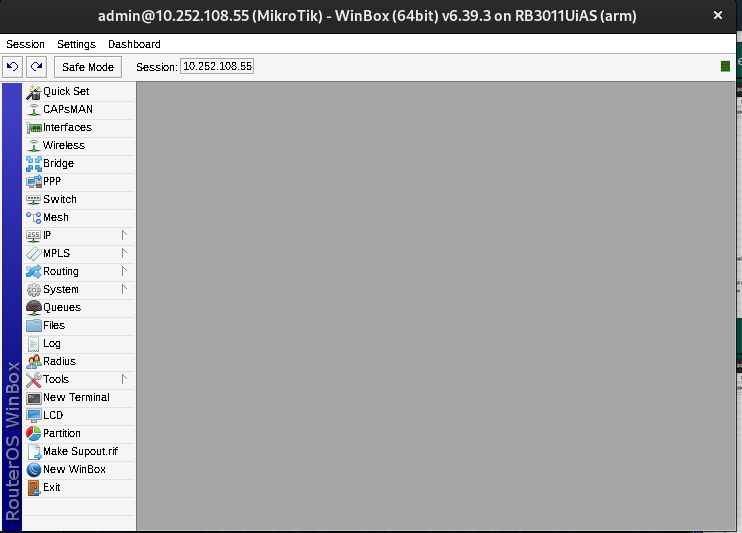

    <h1 style="text-align: center;font-weight: bold">Konfigurasi pada Mikrotik Workshop Administrasi Jaringan</h1>
    <h4 style="text-align: center;">Dosen Pengampu : Dr. Ferry Astika Saputra, S.T., M.Sc.</h4>

 

    
    <h4 style="text-align: center;">Disusun Oleh : </h4>
    

        <strong>Roihanah Inayati Bashiroh</strong> 
        <strong>3123500005 / 2 D3 IT A</strong> 
    

<h3>Politeknik Elektronika Negeri Surabaya Departemen Teknik
Informatika Dan Komputer Program Studi Teknik Informatika 2025/2026</h3>
    

    

---

## Daftar Isi

- [Konfigurasi pada Mikrotik](#konfigurasi-pada-mikrotik)

---

### Konfigurasi pada Mikrotik

1.  Cek ip  
     

 

2. Menjalankan perintah "sudo apt update"  
     

 

3. Mengatasi error sebelumnya  
     

 

4. Berhasil update dan instalasi wine  
     

 

5. Instalisasi winbox  
     

 

6. Membuka winbox  
     

 

7. Berhasil membuka winbox  
     

 

8. Menambahkan ip kelompok lain  
     

 

9. Mencoba ping ke kelompok lain  
     
     
     
     

 

---
