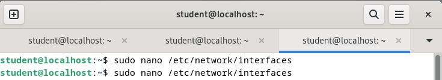
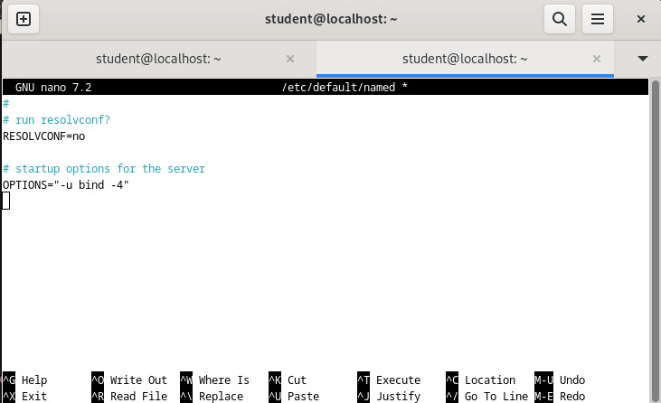

    <h1 style="text-align: center;font-weight: bold">Konfigurasi Bind9 dan Web Server Workshop Administrasi Jaringan</h1>
    <h4 style="text-align: center;">Dosen Pengampu : Dr. Ferry Astika Saputra, S.T., M.Sc.</h4>

 

    
    <h4 style="text-align: center;">Disusun Oleh : </h4>
    

        <strong>Roihanah Inayati Bashiroh</strong> 
        <strong>3123500005 / 2 D3 IT A</strong> 
    

<h3>Politeknik Elektronika Negeri Surabaya Departemen Teknik
Informatika Dan Komputer Program Studi Teknik Informatika 2025/2026</h3>
    

    

---

## Daftar Isi

- [Konfigurasi Bind9](#konfigurasi-bind9)
- [Konfigurasi Web Server (Apache2)](#konfigurasi-web-server-apache2)

---

## Gambar Topologi Jaringan Internal
 

Sebelum konfigurasi Bind9, lakukan setting network untuk mengatur koneksi jaringan secara manual, bukan otomatis dari DHCP. Ini berguna pada server atau sistem yang memerlukan pengaturan jaringan yang konsisten dan tidak berubah.

 

Kemudian setting file `/etc/network/interfaces`

 

Setelah itu lakukan update

 
 

## Konfigurasi Bind9

### Konfigurasi DNS Server (Bind9) Pada Server
1. Instalasi paket dengan menjalankan perintah `apt -y install bind9 bind9utils`

2. Edit dan modifikasi file `/etc/bind/named.conf`

 

3. Modifikasi file `/etc/bind/named.conf.options`

 

 

4. Konfigurasi internal zone pada file `/etc/bind/named.conf.internal-zones`

 

5. Konfigurasi file `/etc/default/named`

 

6. Buat file sesuai dengan domain lokal

 

7. Buat file sesuai dengan IP Address

 
 

### Tes DNS Server 1
1. Tes DNS Server dari jaringan dalam kelompok

 

 
 

## Konfigurasi Web Server (Apache2)
1. Instalasi paket apache2 Jalankan perintah berikut untuk menginstal Apache2

 

2. Pengaturan Dasar Apache2
    - ServerTokens: Edit dan ubah /etc/apache2/conf-enabled/security.conf
    
     
    Ini digunakan menyembunyikan informasi detail versi Apache pada header HTTP, meningkatkan keamanan.
     

    - DirectoryIndex: Edit /etc/apache2/mods-enabled/dir.conf dan atur urutan file index yang dicari ketika direktori diakses:
    
     

    - ServerName: Edit /etc/apache2/apache2.conf dan tambahkan baris berikut untuk mendefinisikan nama server:
    
     
    Ini mencegah munculnya peringatan “Could not reliably determine the server's fully qualified domain name”.
     

    - ServerAdmin: Edit /etc/apache2/sites-enabled/000-default.conf dan ubah baris email admin:
    
     

    - Pengujian dapat dilakukan dengan mengakses domain melalui browser.
    
     

3. Custom tampilan halaman

 

4. Percobaan Akses

 
Dari hasil diatas, berarti konfigurasiu web server sudah berhasil.

